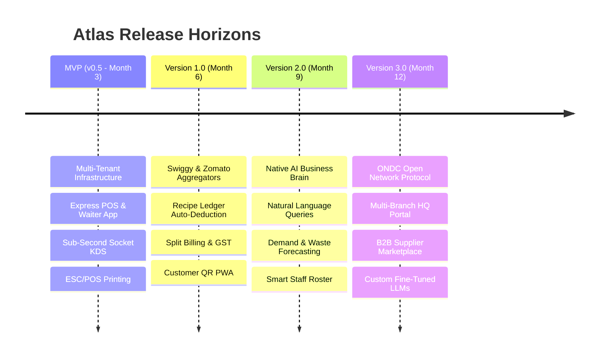

# Atlas — The AI Operating System for Restaurants

[](https://github.com/Mukherjee-Rik/ProjectAtlas)
[](LICENSE)
[](https://nextjs.org/)
[](https://nestjs.com/)
[](https://www.postgresql.org/)
[](https://www.prisma.io/)
[](https://www.docker.com/)
[]()

> **Atlas is not a POS.**  
> Atlas is an enterprise-grade, multi-tenant **AI Restaurant Operating System** that unifies billing, kitchen display systems (KDS), real-time kitchen order tickets (KOT), inventory recipes, aggregator delivery hubs (Swiggy, Zomato, ONDC), employee management, and conversational business intelligence into a single intelligent platform.

---

## 🌟 Key System Capabilities

- ⚡ **Omnichannel Order Hub**: Ingest and manage orders across Dine-In, Table-side Waiter Apps, Direct Customer QR PWA, Swiggy, Zomato, and ONDC in a single pane of glass.
- 🍳 **Sub-Second Real-Time KDS**: Station-routed digital kitchen display system with visual prep timers, audio alerts, and single-tap ticket bumping via Socket.IO.
- 📦 **Predictive Inventory & Recipe Ledger**: Real-time raw ingredient auto-deduction upon order confirmation, FIFO batch tracking, variance detection, and automated Purchase Orders.
- 🤖 **Embedded AI Business Brain**: Natural language conversational business analytics, machine learning demand forecasting (Prophet + XGBoost), automated waste prediction, and dynamic menu pricing recommendations.
- 🔐 **Enterprise Multi-Tenancy & RBAC**: Row-Level Security (RLS) database isolation, RS256 signed JWT session rotation, and granular role-based permissions across 7 pre-defined system roles.
- 🔌 **Deep Ecosystem Integrations**: Native support for Razorpay, Stripe, WhatsApp Cloud API, network ESC/POS thermal printers, barcode scanners, and Tally/QuickBooks accounting exports.

---

## 🏗️ System Architecture

```mermaid
graph TD
    subgraph Client Layer
        WebPOS[Next.js Web POS Terminal]
        KDSUI[React Socket KDS Screen]
        QRPWA[Customer Table QR PWA]
        WaiterApp[Mobile Waiter PWA]
        AdminApp[Admin Multi-Branch Portal]
    end

    subgraph Gateway & Security
        WAF[Cloudflare WAF / DDoS Guard]
        GW[NestJS API Gateway / TLS 1.3]
        AuthGuard[JWT Auth & RLS Tenant Guard]
    end

    subgraph Core Modular Application Services (NestJS)
        AuthSvc[Identity & Tenant Domain]
        OrderSvc[Omnichannel Order Engine]
        KDSSvc[Real-Time Socket Engine]
        StockSvc[Recipe & Stock Ledger]
        BillSvc[Billing & Tax Engine]
        AISvc[AI Brain Engine]
    end

    subgraph Infrastructure Layer
        PostgreSQL[(PostgreSQL 16 Primary)]
        Redis[(Redis Cache & Socket Adapter)]
        PGVector[(PGVector Embedding Store)]
        S3Storage[(MinIO / AWS S3)]
    end

    Client Layer --> WAF --> GW --> AuthGuard
    AuthGuard --> Core Modular Application Services
    Core Modular Application Services <--> Infrastructure Layer
```

---

## 📁 Repository Structure

```
atlas/
├── apps/
│   ├── admin/             # Next.js Multi-Branch Enterprise Admin Portal
│   ├── api/               # NestJS Core Modular Monolith Backend Service
│   └── web/               # Next.js Web POS, KDS Display & Customer QR PWA
├── packages/
│   ├── ui/                # Shared Tailwind CSS + shadcn/ui Component Library
│   ├── config/            # Shared ESLint, TypeScript, and Prettier Configs
│   └── types/             # Shared TypeScript Interfaces & DTO Contracts
├── database/
│   ├── prisma/            # Prisma Schema Definitions & Seed Scripts
│   └── migrations/        # PostgreSQL Database Migration Files
├── docs/                  # Comprehensive Enterprise Product Documentation
│   ├── 01-product-vision.md
│   ├── 02-requirements.md
│   ├── 03-database-design.md
│   ├── 04-api-design.md
│   ├── 05-ui-ux.md
│   ├── 06-development-roadmap.md
│   ├── 07-architecture.md
│   ├── 08-business-rules.md
│   ├── 09-integrations.md
│   └── 10-ai-brain.md
├── infrastructure/        # Infrastructure as Code & Container Setup
│   ├── docker/            # Service-Specific Dockerfiles
│   └── compose/           # Local Development & Staging Docker Compose Files
├── scripts/               # Developer Utility & Database Seeding Scripts
└── README.md              # Atlas Master Readme Document
```

---

## 🚀 Getting Started

### Prerequisites

Ensure you have the following installed on your developer workstation:
- **Node.js**: `v20.x` or later
- **pnpm**: `v8.x` or later (`npm install -g pnpm`)
- **Docker Desktop**: `v24.x` or later with Docker Compose
- **Git**: `v2.x` or later

---

### Step-by-Step Local Setup

#### 1. Clone Repository
```bash
git clone https://github.com/Mukherjee-Rik/ProjectAtlas.git
cd project-atlas
```

#### 2. Environment Configuration
Copy `.env.example` to create your local `.env` configuration:
```bash
cp .env.example .env
```

#### 3. Install Dependencies
Install all pnpm monorepo workspace dependencies:
```bash
pnpm install
```

#### 4. Spin Up Infrastructure Containers
Start local PostgreSQL (with PGVector), Redis, and MinIO storage services:
```bash
pnpm docker:up
```

#### 5. Execute Database Migrations & Seed Data
Initialize the database schema and seed default system tenant, branches, roles, and test menu catalog:
```bash
pnpm db:migrate
pnpm db:seed
```

#### 6. Launch Development Applications
Start all applications concurrently in development mode (API on `:3000`, Web POS on `:3001`, Admin on `:3002`):
```bash
pnpm dev
```

---

## 🐋 Docker Environment

To run the entire Atlas application stack inside isolated Docker containers:

```bash
# Build and run all production container services
docker compose -f infrastructure/compose/docker-compose.yml up --build -d

# View real-time logs across services
docker compose -f infrastructure/compose/docker-compose.yml logs -f

# Shutdown container stack
docker compose -f infrastructure/compose/docker-compose.yml down -v
```

---

## 📚 Complete Project Documentation Index

Atlas maintains exhaustive enterprise documentation inside the [`docs/`](file:///c:/Users/Prabhabi%20Infocom/OneDrive/Desktop/project-atlas/docs) directory:

| Document | Title | Description |
| :--- | :--- | :--- |
| [`01-product-vision.md`](file:///c:/Users/Prabhabi%20Infocom/OneDrive/Desktop/project-atlas/docs/01-product-vision.md) | **Product Vision & Strategy** | Mission, Problem Statement, Competitive Moats, Market Segmentation, and Business Model. |
| [`02-requirements.md`](file:///c:/Users/Prabhabi%20Infocom/OneDrive/Desktop/project-atlas/docs/02-requirements.md) | **Software Requirements (SRS)**| Functional & NFR Specs, User Stories (Gherkin), Module Boundaries, and RBAC Matrix. |
| [`03-database-design.md`](file:///c:/Users/Prabhabi%20Infocom/OneDrive/Desktop/project-atlas/docs/03-database-design.md)| **Database Architecture** | PostgreSQL multi-tenancy, UUIDv7 strategy, Mermaid ERD, table specs, and PGVector indexes. |
| [`04-api-design.md`](file:///c:/Users/Prabhabi%20Infocom/OneDrive/Desktop/project-atlas/docs/04-api-design.md) | **REST API Specifications** | Versioning, RFC 7807 error envelopes, rate limiting, endpoint catalog, and request examples. |
| [`05-ui-ux.md`](file:///c:/Users/Prabhabi%20Infocom/OneDrive/Desktop/project-atlas/docs/05-ui-ux.md) | **UI/UX Design System** | Tailwind tokens, 7 persona user flows, component specs, and ASCII wireframes. |
| [`06-development-roadmap.md`](file:///c:/Users/Prabhabi%20Infocom/OneDrive/Desktop/project-atlas/docs/06-development-roadmap.md)| **Product Development Roadmap**| Sprints 1-24 schedule, Gantt release horizons, risk mitigation, and CI/CD pipelines. |
| [`07-architecture.md`](file:///c:/Users/Prabhabi%20Infocom/OneDrive/Desktop/project-atlas/docs/07-architecture.md) | **Software Architecture** | Clean Architecture, DDD bounded contexts, CQRS, Socket.IO real-time, and caching. |
| [`08-business-rules.md`](file:///c:/Users/Prabhabi%20Infocom/OneDrive/Desktop/project-atlas/docs/08-business-rules.md) | **Business Rules & Policies** | Financial invariants, KOT rules, stock deduction policies, and rule rationales ("WHY"). |
| [`09-integrations.md`](file:///c:/Users/Prabhabi%20Infocom/OneDrive/Desktop/project-atlas/docs/09-integrations.md) | **Ecosystem Integrations** | Swiggy, Zomato, ONDC, Razorpay, Stripe, WhatsApp Cloud API, ESC/POS, and Tally XML. |
| [`10-ai-brain.md`](file:///c:/Users/Prabhabi%20Infocom/OneDrive/Desktop/project-atlas/docs/10-ai-brain.md) | **AI Business Brain Architecture**| Dual-brain cognitive engine, PGVector RAG, multi-agent frameworks, and Text-to-SQL guards. |

---

## 🗺️ Product Roadmap Summary



---

## 🤝 Contributing

We welcome enterprise software engineers and hospitality tech contributors! Please read our [`CONTRIBUTING.md`](CONTRIBUTING.md) for details on our code of conduct, branch conventions (`feature/*`, `fix/*`), and Pull Request submission process.

1. Fork the Repository
2. Create your Feature Branch (`git checkout -b feature/amazing-feature`)
3. Commit your Changes (`git commit -m 'feat: add amazing feature'`)
4. Push to the Branch (`git push origin feature/amazing-feature`)
5. Open a Pull Request

---

## 📄 License

This project is licensed under the **MIT License** - see the [LICENSE](LICENSE) file for details.

---

<p align="center">
  <b>Atlas</b> — Built with ❤️ for the global hospitality industry.
</p>