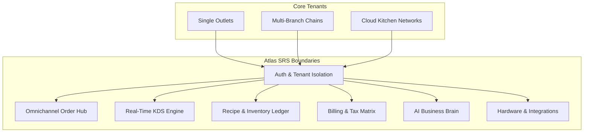
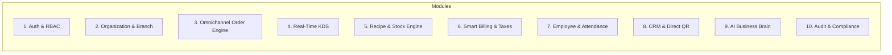
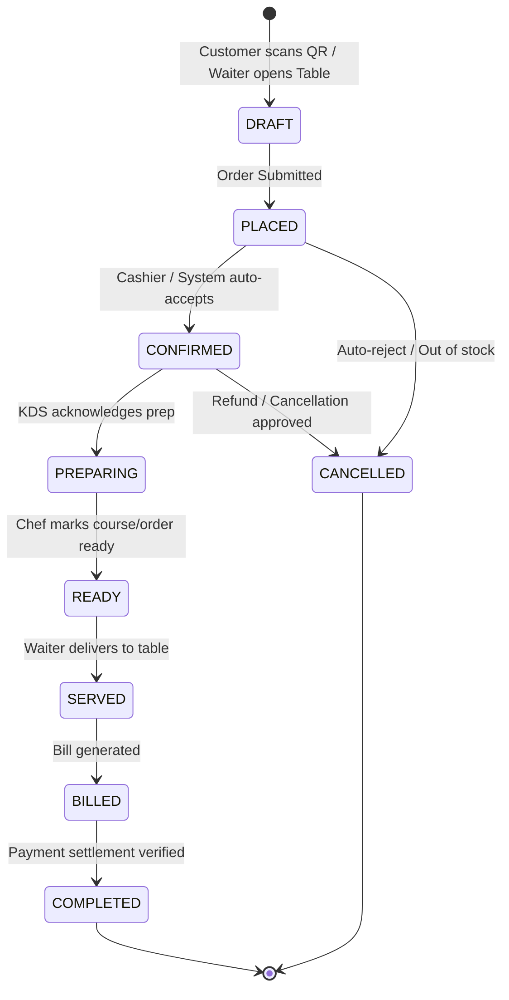
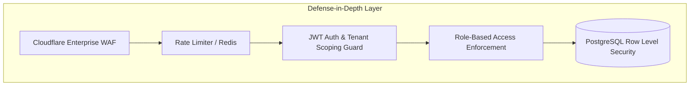
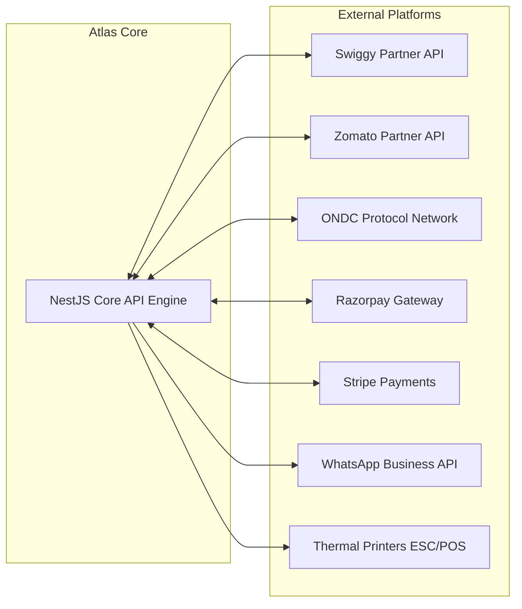

# Atlas Software Requirements Specification (SRS)
**Document Version:** 1.0.0  
**Status:** Approved Architectural Document  
**Author:** Office of the CTO & Lead Solution Architect  
**Target System:** Atlas — AI Restaurant Operating System

---

## 1. Executive Overview & Scope

This document specifies the complete functional, non-functional, security, business, and integration requirements for **Atlas**. 

Atlas is an enterprise multi-tenant Software-as-a-Service (SaaS) platform engineered to manage modern restaurant operations. It unifies order management (Dine-in, Takeaway, QR, Aggregators), kitchen operations (KDS/KOT), inventory recipes, billing, payment processing, employee management, and AI-driven business intelligence into a seamless, high-availability architecture.



---

## 2. Business Requirements (BRD)

| Requirement ID | Business Objective | Target Metric | Priority |
| :--- | :--- | :--- | :--- |
| **BR-01** | Multi-Channel Aggregation | Consolidate 100% of order channels (Dine-In, QR, Swiggy, Zomato, ONDC) into a single pane of glass. | **P0 (Critical)** |
| **BR-02** | Inventory & Waste Control | Reduce raw material inventory leakage and food waste via real-time batch and recipe deduction. | **P0 (Critical)** |
| **BR-03** | Operational Acceleration | Lower average Kitchen Order Ticket (KOT) fulfillment duration by eliminating manual receipt handling. | **P0 (Critical)** |
| **BR-04** | Direct Consumer Retention | Drive direct dine-in and online ordering via branded QR storefronts to minimize 3rd-party commissions. | **P1 (High)** |
| **BR-05** | Multi-Tenant Data Governance | Provide zero cross-tenant data leakage while enabling multi-branch corporate chain oversight. | **P0 (Critical)** |
| **BR-06** | AI Operational Intelligence | Deliver predictive stock reordering, demand forecasting, and natural language business insights. | **P1 (High)** |

---

## 3. System Architecture & Module Boundaries

Atlas is divided into 10 cohesive core domain modules:



---

## 4. Functional Requirements Specification (FRD)

### 4.1. Module 1: Identity, Authentication & Multi-Tenancy
- **FR-1.1**: The system MUST support Multi-Tenant isolation at the database level where every record belongs to a specific `TenantId` (Organization).
- **FR-1.2**: Authentication MUST utilize JWT (JSON Web Tokens) short-lived access tokens (15-min lifespan) and secure HTTP-Only refresh tokens (7-day rotation).
- **FR-1.3**: Support multi-factor authentication (MFA) via OTP (SMS/WhatsApp) and OAuth2 (Google SSO).
- **FR-1.4**: Enforce granular Role-Based Access Control (RBAC) supporting custom roles per branch.
- **FR-1.5**: Support multi-tenant subdomains (e.g., `brand1.atlasapp.com`) and custom domain mapping for enterprise tenants.

### 4.2. Module 2: Organization, Branch & Table Setup
- **FR-2.1**: Support hierarchical organization mapping: `Organization` -> `Brand` -> `Branch` -> `Floor Zone` -> `Table`.
- **FR-2.2**: Floor plan editor MUST allow visual drag-and-drop creation of dynamic table layouts (capacities, shapes, status colors).
- **FR-2.3**: System MUST generate dynamic, secure QR codes per table encoding `BranchId`, `TableId`, and cryptographic signature.
- **FR-2.4**: Multi-branch support MUST enable global menu templates with branch-level overrides for pricing and item availability.

### 4.3. Module 3: Omnichannel Order Processing Engine
- **FR-3.1**: Ingest orders simultaneously from Dine-in (Waiter App), Self-service Table QR, Takeaway POS, Swiggy, Zomato, and ONDC.
- **FR-3.2**: Order State Machine MUST enforce valid state transitions strictly:



- **FR-3.3**: Support order split, merge, table transfer, and course-based ordering (Appetizers, Mains, Desserts).
- **FR-3.4**: Offline mode MUST allow local POS order placement during network disconnects and auto-sync upon reconnection.

### 4.4. Module 4: Real-Time Kitchen Display System (KDS) & KOT Routing
- **FR-4.1**: Dispatch digital Kitchen Order Tickets (KOT) in sub-100ms via WebSockets to role-specific KDS screens (e.g., Grill Station, Bar, Dessert Station).
- **FR-4.2**: KDS displays MUST provide visual prep timers, color-coded urgency alerts (Green < 10m, Yellow 10-15m, Red > 15m), and item modifier tags.
- **FR-4.3**: Support direct ESC/POS hardware thermal printer dispatch for fallback physical paper KOT printing.
- **FR-4.4**: Allow chefs to mark individual items as "86'd" (Out of Stock), instantly auto-pausing the item across Swiggy, Zomato, QR menus, and POS terminals.

### 4.5. Module 5: Inventory, Recipe & Stock Engine
- **FR-5.1**: Maintain real-time stock ledgers for raw ingredients, semi-finished preps, and packaged goods across branches.
- **FR-5.2**: Recipe Engine MUST auto-deduct raw material inventory based on item component recipes upon order state transitioning to `CONFIRMED`.
- **FR-5.3**: Track ingredient batch numbers, manufacturing dates, and expiration dates with automatic First-In, First-Out (FIFO) deduction logic.
- **FR-5.4**: Calculate variance between theoretical consumption (recipe-based) and actual stock count to detect theft and over-portioning.
- **FR-5.5**: Generate automated Low-Stock Alerts and draft Purchase Orders (POs) when stock breaches configurable safety reorder thresholds.

### 4.6. Module 6: Smart Billing, Tax & Payment Gateway
- **FR-6.1**: Support multi-country tax engines (e.g., India GST split CGST/SGST/IGST, US Sales Tax, VAT).
- **FR-6.2**: Provide split billing functionality by seat, by item count, or equal monetary divisions.
- **FR-6.3**: Integrate native digital payment collection via Razorpay, Stripe, UPI Intent, Dynamic QR, Card Terminals, and Cash handling.
- **FR-6.4**: Support granular discount rules (item-level, order-level, manager override authorization, promotional coupon codes).

### 4.7. Module 7: Employee Management & Attendance
- **FR-7.1**: Shift management, PIN-based quick employee clock-in/clock-out, and daily shift cash register reconciliation.
- **FR-7.2**: Track waiter performance metrics (average order value, upsell revenue, order service time, table turnover rate).

### 4.8. Module 8: Customer CRM & QR Direct Storefront
- **FR-8.1**: Customer unified profile creation aggregating visit history, lifetime spent, dietary preferences, and feedback ratings.
- **FR-8.2**: Progressive Web App (PWA) QR code table ordering interface requiring zero app installation for diners.

### 4.9. Module 9: AI Business Brain & Analytics
- **FR-9.1**: Natural language query engine converting conversational questions into dynamic SQL/analytics executions.
- **FR-9.2**: Machine Learning predictive sales demand forecasting by day part, weather, and day of week.
- **FR-9.3**: AI Recipe Costing Engine calculating live profit margin changes based on fluctuating raw ingredient vendor purchase prices.

### 4.10. Module 10: Audit, Security & System Governance
- **FR-10.1**: Immutable audit logs capturing every critical system event (bill voiding, price overrides, stock adjustments, role updates).
- **FR-10.2**: Exportable financial ledger reports compliant with standard accounting formats (Tally XML, QuickBooks CSV, Excel).

---

## 5. Non-Functional Requirements (NFR)

### 5.1. Performance & Latency Requirements

```mermaid
gantt
    title Latency SLA Targets (Milliseconds)
    dateFormat  X
    axisFormat %s ms
    section API & Realtime
    POSIX / DB Query Response          :0, 100
    Socket Broadcast to KDS            :0, 50
    Omnichannel Order Ingestion        :0, 200
    Aggregator Menu Sync Push          :0, 1500
```



- **NFR-PERF-1**: 95% of standard HTTP REST API queries MUST respond in `< 150ms`.
- **NFR-PERF-2**: Socket.IO KDS event broadcast latency MUST be `< 50ms` from order placement to visual render.
- **NFR-PERF-3**: Database read queries MUST utilize Redis caching to achieve sub-10ms response times for menu catalog retrievals.

### 5.2. Scalability & Capacity Requirements
- **NFR-SCALE-1**: Platform MUST scale horizontally to support **10,000 active concurrent merchant branches**.
- **NFR-SCALE-2**: Architecture MUST comfortably process a peak throughput of **2,500 orders per second (TPS)** across all tenants during weekend rush hours.
- **NFR-SCALE-3**: Database design MUST utilize PostgreSQL partitioning and read-replicas to maintain performance as transaction tables scale beyond 100 million rows.

### 5.3. Reliability & Availability Requirements
- **NFR-AVAIL-1**: System service availability MUST meet **99.99% Uptime SLA** (excluding scheduled zero-downtime maintenance windows).
- **NFR-AVAIL-2**: POS terminals MUST feature local IndexedDB/Edge Storage state to remain fully functional during internet outages.

---

## 6. Security Requirements



- **SEC-1 (Multi-Tenant Isolation)**: Database queries MUST strictly enforce tenant filtering via NestJS Interceptors and Prisma Middleware (`WHERE tenantId = x`).
- **SEC-2 (Data Encryption)**: All data in transit MUST be encrypted via TLS 1.3. Sensitive fields (API keys, customer PII) at rest MUST be encrypted using AES-256-GCM.
- **SEC-3 (Token Security)**: JWT tokens must be cryptographically signed using RS256 algorithm. Refresh tokens stored in DB MUST be hashed using bcrypt/argon2.
- **SEC-4 (PCI-DSS Compliance)**: Payment card details MUST NEVER be stored on Atlas servers. All transactions delegate to PCI-DSS Level 1 compliant payment providers.
- **SEC-5 (Rate Limiting)**: Protect APIs against abuse using IP and Tenant rate limiters (100 requests per minute per IP for public endpoints; 1000/min for authenticated endpoints).

---

## 7. User Stories & Acceptance Criteria

### US-01: Omnichannel Order Ingestion & Auto-Acceptance
**As a** Cloud Kitchen Manager,  
**I want** orders from Swiggy, Zomato, and my QR Storefront to automatically ingest into Atlas without manual re-typing,  
**So that** kitchen preparation starts immediately without human delay or transcription error.

```gherkin
Feature: Automated Multi-Channel Order Ingestion

  Scenario: Successful auto-ingestion from Swiggy partner webhook
    Given the Swiggy aggregator integration is ACTIVE for Branch "Indiranagar-01"
    And Auto-Acceptance setting is ENABLED
    When Swiggy posts a new order payload via webhook
    Then Atlas should ingest the order into database with status "CONFIRMED"
    And broadcast the order to Indiranagar-01 KDS screens in < 50ms
    And auto-deduct recipe raw ingredients from stock ledger
    And trigger desktop notification audio cue on KDS terminal
```

### US-02: KDS Real-Time Station Preparation Routing
**As a** Head Chef,  
**I want** incoming kitchen order items to split automatically across specialized station screens (Grill, Drinks, Salad),  
**So that** station cooks only see items assigned to their prep domain.

```gherkin
Feature: Station-based KOT Item Routing

  Scenario: Splitting a multi-category order across KDS screens
    Given an order contains 1x "Tandoori Chicken" (Grill), 1x "Mojito" (Bar), 1x "Brownie" (Dessert)
    When the order state transitions to "CONFIRMED"
    Then the "Tandoori Chicken" item appears only on the "Grill KDS"
    And the "Mojito" item appears only on the "Bar KDS"
    And the "Brownie" item appears only on the "Dessert KDS"
    And when the Bar cook completes the "Mojito", the overall order shows "Bar Prep Complete" on Expediter screen
```

### US-03: Real-Time Recipe Stock Auto-Deduction & Out-of-Stock Trigger
**As an** Inventory Manager,  
**I want** raw ingredient balances to auto-deduct when an order is accepted, and auto-pause items when ingredients hit zero,  
**So that** customers cannot order items that kitchen cannot prepare.

```gherkin
Feature: Automated Recipe Deduction & Stock Guard

  Scenario: Ingredient depletion auto-86s menu item
    Given menu item "Cheese Burger" requires 1 unit of "Burger Bun"
    And current stock balance of "Burger Bun" is 1 unit
    When a customer places an order for 1x "Cheese Burger"
    Then "Burger Bun" stock updates to 0 units
    And system automatically marks "Cheese Burger" as OUT_OF_STOCK
    And pushes Out-of-Stock status update to Swiggy, Zomato, and QR ordering channels within 2 seconds
```

### US-04: Conversational AI Natural Language Analytics
**As a** Restaurant Owner,  
**I want** to ask natural language questions about my business performance,  
**So that** I get instant data insights without building complex manual reports.

```gherkin
Feature: Natural Language AI Analytical Query

  Scenario: Owner queries food cost variance
    Given the Owner is authenticated on the Atlas Admin Mobile/Web App
    When the Owner types "Why did my food cost increase this week at Branch Central?"
    Then the AI Brain should query historical purchase orders and inventory variance ledgers
    And respond with: "Food cost increased by 4.2% primarily due to a 15% price spike in Paneer from vendor ABC Supplies."
    And present a structured visualization comparing item prices over 30 days
```

---

## 8. Enterprise Role & Permission Matrix (RBAC)

Atlas enforces 7 pre-defined system roles with granular permission flags:

| Permission Domain | Permission Flag | Super Admin | Owner | Branch Mgr | Cashier | Waiter | Chef | Accountant |
| :--- | :--- | :---: | :---: | :---: | :---: | :---: | :---: | :---: |
| **System Governance** | `system:manage_tenants` | ✅ | ❌ | ❌ | ❌ | ❌ | ❌ | ❌ |
| **Organization Config**| `org:update_settings` | ✅ | ✅ | ❌ | ❌ | ❌ | ❌ | ❌ |
| **Branch Operations** | `branch:override_price` | ✅ | ✅ | ✅ | ❌ | ❌ | ❌ | ❌ |
| **Order Management** | `order:create_dine_in` | ✅ | ✅ | ✅ | ✅ | ✅ | ❌ | ❌ |
| | `order:void_bill` | ✅ | ✅ | ✅ | ❌ | ❌ | ❌ | ❌ |
| **Kitchen Operations** | `kds:update_item_state`| ✅ | ✅ | ✅ | ❌ | ❌ | ✅ | ❌ |
| | `kds:mark_86_item` | ✅ | ✅ | ✅ | ❌ | ❌ | ✅ | ❌ |
| **Inventory & Stock** | `inventory:adjust_stock`| ✅ | ✅ | ✅ | ❌ | ❌ | ❌ | ❌ |
| | `inventory:approve_po` | ✅ | ✅ | ❌ | ❌ | ❌ | ❌ | ✅ |
| **Financial Analytics**| `reports:view_pnl` | ✅ | ✅ | ❌ | ❌ | ❌ | ❌ | ✅ |

---

## 9. Integration Requirements



- **INT-1 (Food Aggregators)**: Bi-directional webhooks for live order ingestion, menu sync, and out-of-stock toggling with Swiggy and Zomato.
- **INT-2 (ONDC Protocol)**: Support Beckn Protocol specifications for publishing menus, inventory, and fulfillment tracking to the ONDC open network.
- **INT-3 (Payment Gateways)**: Webhook listeners verifying payment signatures for Razorpay, Stripe, and UPI Intent deep links.
- **INT-4 (Customer Messaging)**: Integration with Meta WhatsApp Business API and FCM (Firebase Cloud Messaging) for order status updates.
- **INT-5 (Hardware Integration)**: Native support for ESC/POS network thermal receipt printers, USB barcode scanners, and customer-facing displays.

---

## 10. Future Requirements & System Roadmap

1. **IoT Smart Kitchen Integration**: Direct Bluetooth/Zigbee sensor integration monitoring refrigeration temperatures and deep fryer oil longevity.
2. **AI Voice Order Ingestion**: Voice AI agent taking phone orders and drive-thru orders, automatically converting speech to structured Atlas orders.
3. **Automated Facial Attendance**: Optional facial recognition clock-in terminal for kitchen and dining staff.