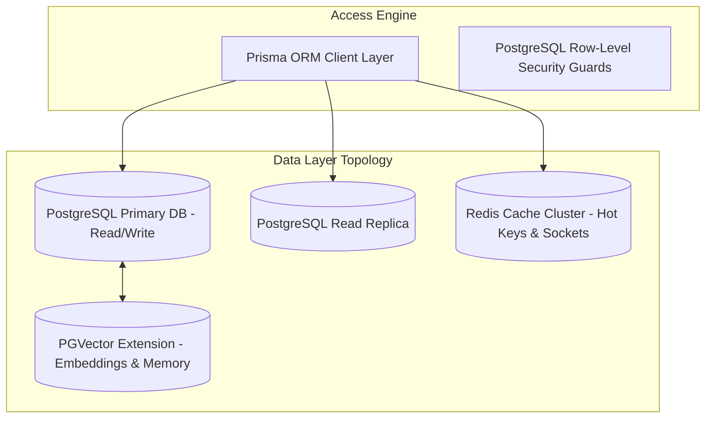
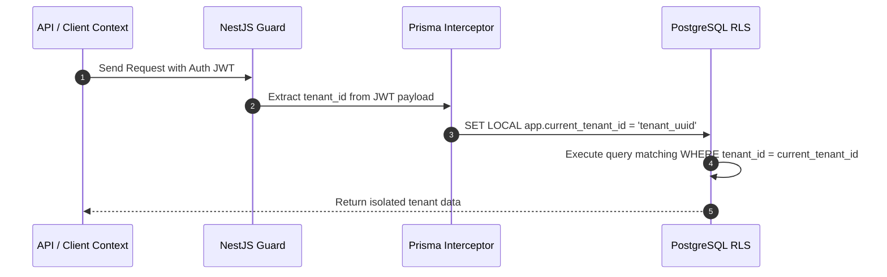
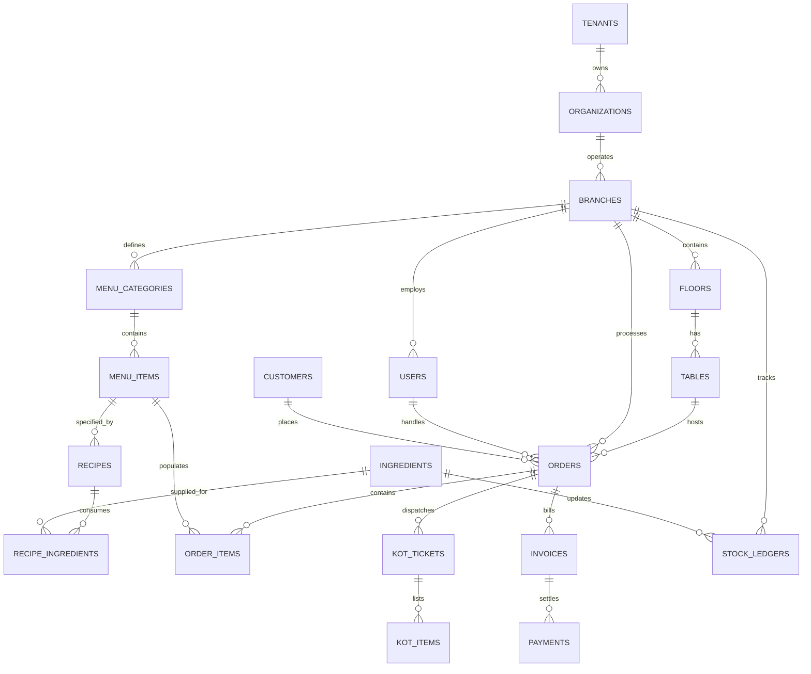
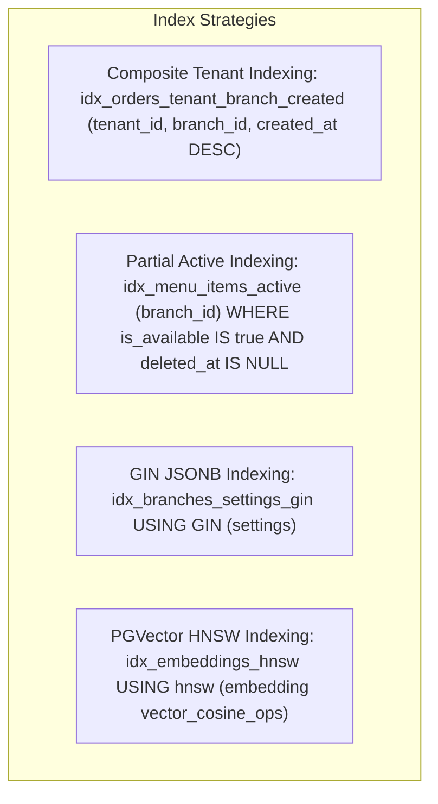
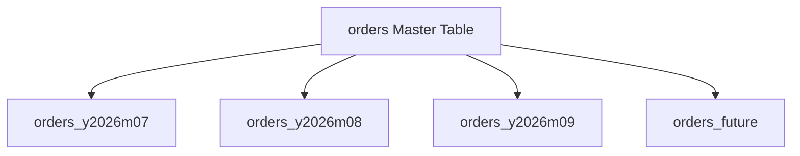

# Atlas Database Architecture & Design Specification
**Document Version:** 1.0.0  
**Status:** Approved Architectural Standard  
**Author:** Office of the CTO & Lead Database Architect  
**Target Engine:** PostgreSQL 16+ with PGVector Extension  
**ORM Target:** Prisma ORM

---

## 1. Executive Database Strategy

The **Atlas** database architecture is designed for multi-tenant scalability, transactional integrity, sub-second query performance, and seamless AI vector capability. It serves as the single source of truth across all restaurant channels (POS, KDS, QR, Swiggy, Zomato, ONDC, and AI Brain).

---

## 2. Multi-Tenant Architecture & Data Isolation

Atlas implements a **Shared Database, Shared Schema** multi-tenancy model using a mandatory `tenant_id` discriminator column across all business entities, combined with PostgreSQL **Row-Level Security (RLS)** and Prisma Interceptor Middleware.

### Key Multi-Tenancy Principles:
1. **Mandatory Tenant Discriminator**: Every tenant-owned table MUST contain a non-nullable `tenant_id UUID` column.
2. **PostgreSQL RLS Safety Net**: Even if application-level code forgets a `WHERE tenant_id = x` clause, PostgreSQL RLS policies block cross-tenant data leaks at the engine level.
3. **Branch Partitioning**: Secondary scoping is enforced via `branch_id UUID` for multi-location operational isolation.

---

## 3. Primary Key & Identifier Strategy

- **Primary Keys**: All tables use **UUIDv7** (time-sortable 128-bit UUIDs) as primary keys (`id`).
  - *Why UUIDv7?* Unlike random UUIDv4, UUIDv7 is monotonically increasing based on timestamp. This eliminates B-Tree index fragmentation while retaining global uniqueness across distributed systems.
- **Foreign Keys**: Named as `<entity>_id` matching the referenced table's singular entity name (e.g., `branch_id`, `order_id`).
- **Human-Readable Identifiers**: Business documents (Bills, Orders, KOTs, POs) feature human-friendly formatted sequential numbers generated per branch (e.g., `ORD-20260731-0042`).

---

## 4. Naming Conventions & System Standards

- **Tables**: `snake_case`, pluralized (e.g., `organizations`, `menu_items`, `kitchen_orders`).
- **Columns**: `snake_case`, singular (e.g., `unit_price`, `is_active`, `prepared_at`).
- **Foreign Key Indexes**: `idx_<table_name>_<column_name>`.
- **Unique Indexes**: `uq_<table_name>_<column_names>`.
- **Soft Delete Standard**: All core business entity tables contain:
  - `deleted_at TIMESTAMP WITH TIME ZONE NULL`
  - `deleted_by UUID NULL`
- **Audit Columns**: Standard audit fields present on every mutable table:
  - `created_at TIMESTAMP WITH TIME ZONE DEFAULT CURRENT_TIMESTAMP NOT NULL`
  - `updated_at TIMESTAMP WITH TIME ZONE DEFAULT CURRENT_TIMESTAMP NOT NULL`
  - `created_by UUID NULL`
  - `updated_by UUID NULL`

---

## 5. Comprehensive Entity-Relationship Diagram (Mermaid ERD)

---

## 6. Detailed Table Specifications by Domain

### 6.1. Domain 1: Multi-Tenancy & Identity

#### `tenants`
Root tenant account managing billing subscription and SaaS quota.
- `id` (UUIDv7, PK, NOT NULL)
- `name` (VARCHAR(100), NOT NULL)
- `subdomain` (VARCHAR(50), UNIQUE, NOT NULL)
- `subscription_tier` (ENUM: `STARTER`, `GROWTH`, `ENTERPRISE`, `CLOUD_KITCHEN`, NOT NULL)
- `is_active` (BOOLEAN, DEFAULT true, NOT NULL)
- `created_at` (TIMESTAMPTZ, DEFAULT CURRENT_TIMESTAMP)
- `updated_at` (TIMESTAMPTZ, DEFAULT CURRENT_TIMESTAMP)
- `deleted_at` (TIMESTAMPTZ, NULL)

#### `organizations`
Represents the business enterprise entity.
- `id` (UUIDv7, PK, NOT NULL)
- `tenant_id` (UUIDv7, FK -> `tenants.id`, NOT NULL)
- `legal_name` (VARCHAR(150), NOT NULL)
- `tax_identifier` (VARCHAR(50), NULL) - e.g., GSTIN / VAT Number
- `currency_code` (VARCHAR(3), DEFAULT 'INR', NOT NULL)
- `timezone` (VARCHAR(50), DEFAULT 'Asia/Kolkata', NOT NULL)
- `created_at` (TIMESTAMPTZ, DEFAULT CURRENT_TIMESTAMP)

#### `branches`
Physical or virtual restaurant locations.
- `id` (UUIDv7, PK, NOT NULL)
- `tenant_id` (UUIDv7, FK -> `tenants.id`, NOT NULL)
- `organization_id` (UUIDv7, FK -> `organizations.id`, NOT NULL)
- `name` (VARCHAR(100), NOT NULL) - e.g., "Indiranagar Branch"
- `branch_code` (VARCHAR(20), NOT NULL) - e.g., "IND-01"
- `address` (JSONB, NOT NULL) - Structured address format
- `phone` (VARCHAR(20), NOT NULL)
- `email` (VARCHAR(100), NULL)
- `is_cloud_kitchen` (BOOLEAN, DEFAULT false, NOT NULL)
- `settings` (JSONB, DEFAULT '{}', NOT NULL) - Opening hours, tax configs
- `created_at` (TIMESTAMPTZ, DEFAULT CURRENT_TIMESTAMP)

#### `users`
System personnel across all roles.
- `id` (UUIDv7, PK, NOT NULL)
- `tenant_id` (UUIDv7, FK -> `tenants.id`, NOT NULL)
- `branch_id` (UUIDv7, FK -> `branches.id`, NULL) - Primary branch assignment
- `email` (VARCHAR(150), NOT NULL)
- `phone` (VARCHAR(20), NOT NULL)
- `password_hash` (VARCHAR(255), NOT NULL)
- `pin_code_hash` (VARCHAR(255), NULL) - For quick POS clock-in
- `first_name` (VARCHAR(50), NOT NULL)
- `last_name` (VARCHAR(50), NOT NULL)
- `role` (ENUM: `SUPER_ADMIN`, `OWNER`, `BRANCH_MANAGER`, `CASHIER`, `WAITER`, `CHEF`, `ACCOUNTANT`, NOT NULL)
- `is_active` (BOOLEAN, DEFAULT true, NOT NULL)
- `created_at` (TIMESTAMPTZ, DEFAULT CURRENT_TIMESTAMP)

---

### 6.2. Domain 2: Dining Room Layout & Tables

#### `floors`
- `id` (UUIDv7, PK, NOT NULL)
- `tenant_id` (UUIDv7, FK, NOT NULL)
- `branch_id` (UUIDv7, FK -> `branches.id`, NOT NULL)
- `name` (VARCHAR(50), NOT NULL) - e.g., "Main Dining", "Rooftop"
- `display_order` (INTEGER, DEFAULT 0, NOT NULL)

#### `tables`
- `id` (UUIDv7, PK, NOT NULL)
- `tenant_id` (UUIDv7, FK, NOT NULL)
- `branch_id` (UUIDv7, FK -> `branches.id`, NOT NULL)
- `floor_id` (UUIDv7, FK -> `floors.id`, NOT NULL)
- `table_number` (VARCHAR(20), NOT NULL) - e.g., "T-01"
- `seating_capacity` (INTEGER, DEFAULT 4, NOT NULL)
- `qr_code_signature` (VARCHAR(255), UNIQUE, NOT NULL)
- `status` (ENUM: `VACANT`, `OCCUPIED`, `RESERVED`, `DIRTY`, DEFAULT 'VACANT', NOT NULL)
- `shape` (VARCHAR(20), DEFAULT 'RECTANGLE', NOT NULL)
- `position_x` (INTEGER, DEFAULT 0) - Floor plan canvas coordinates
- `position_y` (INTEGER, DEFAULT 0)

---

### 6.3. Domain 3: Menu Catalog & Pricing Engine

#### `menu_categories`
- `id` (UUIDv7, PK, NOT NULL)
- `tenant_id` (UUIDv7, FK, NOT NULL)
- `branch_id` (UUIDv7, FK, NULL) - Null indicates global organisation category
- `name` (VARCHAR(100), NOT NULL) - e.g., "Starters", "Beverages"
- `display_order` (INTEGER, DEFAULT 0)
- `is_active` (BOOLEAN, DEFAULT true)

#### `menu_items`
- `id` (UUIDv7, PK, NOT NULL)
- `tenant_id` (UUIDv7, FK, NOT NULL)
- `category_id` (UUIDv7, FK -> `menu_categories.id`, NOT NULL)
- `name` (VARCHAR(150), NOT NULL)
- `description` (TEXT, NULL)
- `base_price` (NUMERIC(10, 2), NOT NULL)
- `tax_rate_percentage` (NUMERIC(5, 2), DEFAULT 5.00, NOT NULL)
- `item_type` (ENUM: `VEG`, `NON_VEG`, `EGG`, `VEGAN`, NOT NULL)
- `sku` (VARCHAR(50), NULL)
- `image_url` (VARCHAR(500), NULL)
- `is_available` (BOOLEAN, DEFAULT true, NOT NULL) - Auto-paused when 86'd
- `preparation_time_minutes` (INTEGER, DEFAULT 15, NOT NULL)
- `created_at` (TIMESTAMPTZ, DEFAULT CURRENT_TIMESTAMP)

---

### 6.4. Domain 4: Omnichannel Order Processing

#### `orders`
Master record for every customer order across channels.
- `id` (UUIDv7, PK, NOT NULL)
- `tenant_id` (UUIDv7, FK, NOT NULL)
- `branch_id` (UUIDv7, FK -> `branches.id`, NOT NULL)
- `table_id` (UUIDv7, FK -> `tables.id`, NULL) - Nullable for Takeaway/Delivery
- `waiter_id` (UUIDv7, FK -> `users.id`, NULL)
- `customer_id` (UUIDv7, FK -> `customers.id`, NULL)
- `order_number` (VARCHAR(50), NOT NULL) - Human readable, e.g. "ORD-00102"
- `channel` (ENUM: `DINE_IN`, `TAKEAWAY`, `QR_DIRECT`, `SWIGGY`, `ZOMATO`, `ONDC`, NOT NULL)
- `status` (ENUM: `DRAFT`, `PLACED`, `CONFIRMED`, `PREPARING`, `READY`, `SERVED`, `BILLED`, `COMPLETED`, `CANCELLED`, NOT NULL)
- `subtotal` (NUMERIC(10, 2), NOT NULL)
- `tax_amount` (NUMERIC(10, 2), NOT NULL)
- `discount_amount` (NUMERIC(10, 2), DEFAULT 0.00, NOT NULL)
- `total_amount` (NUMERIC(10, 2), NOT NULL)
- `aggregator_order_id` (VARCHAR(100), NULL) - External Swiggy/Zomato ID
- `placed_at` (TIMESTAMPTZ, DEFAULT CURRENT_TIMESTAMP, NOT NULL)
- `completed_at` (TIMESTAMPTZ, NULL)

#### `order_items`
- `id` (UUIDv7, PK, NOT NULL)
- `tenant_id` (UUIDv7, FK, NOT NULL)
- `order_id` (UUIDv7, FK -> `orders.id`, NOT NULL)
- `menu_item_id` (UUIDv7, FK -> `menu_items.id`, NOT NULL)
- `item_name` (VARCHAR(150), NOT NULL) - Snapshot name at purchase
- `quantity` (INTEGER, NOT NULL)
- `unit_price` (NUMERIC(10, 2), NOT NULL)
- `tax_amount` (NUMERIC(10, 2), NOT NULL)
- `total_price` (NUMERIC(10, 2), NOT NULL)
- `notes` (VARCHAR(255), NULL) - Special cooking instructions
- `status` (ENUM: `PENDING`, `PREPARING`, `READY`, `SERVED`, `CANCELLED`, DEFAULT 'PENDING', NOT NULL)

#### `kot_tickets`
Kitchen Order Tickets generated for station display/printing.
- `id` (UUIDv7, PK, NOT NULL)
- `tenant_id` (UUIDv7, FK, NOT NULL)
- `branch_id` (UUIDv7, FK, NOT NULL)
- `order_id` (UUIDv7, FK -> `orders.id`, NOT NULL)
- `kot_number` (VARCHAR(50), NOT NULL) - e.g., "KOT-0089"
- `kitchen_station` (VARCHAR(50), NOT NULL) - e.g., "GRILL", "BAR"
- `status` (ENUM: `NEW`, `IN_PREP`, `COMPLETED`, DEFAULT 'NEW', NOT NULL)
- `dispatched_at` (TIMESTAMPTZ, DEFAULT CURRENT_TIMESTAMP, NOT NULL)
- `completed_at` (TIMESTAMPTZ, NULL)

---

### 6.5. Domain 5: Recipe & Inventory Ledger

#### `ingredients`
- `id` (UUIDv7, PK, NOT NULL)
- `tenant_id` (UUIDv7, FK, NOT NULL)
- `organization_id` (UUIDv7, FK, NOT NULL)
- `name` (VARCHAR(150), NOT NULL) - e.g., "Paneer", "Olive Oil"
- `unit_of_measure` (ENUM: `KG`, `GRAM`, `LITER`, `ML`, `PIECE`, `BOX`, NOT NULL)
- `minimum_reorder_level` (NUMERIC(10, 3), NOT NULL)
- `cost_per_unit` (NUMERIC(10, 2), NOT NULL)

#### `recipes`
- `id` (UUIDv7, PK, NOT NULL)
- `tenant_id` (UUIDv7, FK, NOT NULL)
- `menu_item_id` (UUIDv7, FK -> `menu_items.id`, UNIQUE, NOT NULL)

#### `recipe_ingredients`
Mapping table for recipe breakdown.
- `id` (UUIDv7, PK, NOT NULL)
- `tenant_id` (UUIDv7, FK, NOT NULL)
- `recipe_id` (UUIDv7, FK -> `recipes.id`, NOT NULL)
- `ingredient_id` (UUIDv7, FK -> `ingredients.id`, NOT NULL)
- `quantity_required` (NUMERIC(10, 3), NOT NULL)

#### `stock_ledgers`
Immutable transaction ledger for all stock movements.
- `id` (UUIDv7, PK, NOT NULL)
- `tenant_id` (UUIDv7, FK, NOT NULL)
- `branch_id` (UUIDv7, FK -> `branches.id`, NOT NULL)
- `ingredient_id` (UUIDv7, FK -> `ingredients.id`, NOT NULL)
- `transaction_type` (ENUM: `RECIPE_DEDUCTION`, `MANUAL_PURCHASE`, `WASTE_SPOILAGE`, `BRANCH_TRANSFER`, `AUDIT_ADJUSTMENT`, NOT NULL)
- `quantity_delta` (NUMERIC(10, 3), NOT NULL) - Positive for additions, negative for consumption
- `balance_after` (NUMERIC(10, 3), NOT NULL)
- `reference_order_id` (UUIDv7, FK -> `orders.id`, NULL)
- `created_at` (TIMESTAMPTZ, DEFAULT CURRENT_TIMESTAMP, NOT NULL)

---

### 6.6. Domain 6: Billing, Tax & Payments

#### `invoices`
- `id` (UUIDv7, PK, NOT NULL)
- `tenant_id` (UUIDv7, FK, NOT NULL)
- `branch_id` (UUIDv7, FK, NOT NULL)
- `order_id` (UUIDv7, FK -> `orders.id`, UNIQUE, NOT NULL)
- `invoice_number` (VARCHAR(50), UNIQUE, NOT NULL) - Tax invoice number
- `subtotal` (NUMERIC(10, 2), NOT NULL)
- `cgst_amount` (NUMERIC(10, 2), DEFAULT 0.00)
- `sgst_amount` (NUMERIC(10, 2), DEFAULT 0.00)
- `discount_amount` (NUMERIC(10, 2), DEFAULT 0.00)
- `final_total` (NUMERIC(10, 2), NOT NULL)
- `is_settled` (BOOLEAN, DEFAULT false, NOT NULL)
- `issued_at` (TIMESTAMPTZ, DEFAULT CURRENT_TIMESTAMP, NOT NULL)

#### `payments`
- `id` (UUIDv7, PK, NOT NULL)
- `tenant_id` (UUIDv7, FK, NOT NULL)
- `invoice_id` (UUIDv7, FK -> `invoices.id`, NOT NULL)
- `payment_method` (ENUM: `CASH`, `CARD`, `UPI_INTENT`, `RAZORPAY`, `STRIPE`, `SWIGGY_PAY`, NOT NULL)
- `amount` (NUMERIC(10, 2), NOT NULL)
- `transaction_reference` (VARCHAR(100), NULL)
- `status` (ENUM: `INITIATED`, `SUCCESS`, `FAILED`, `REFUNDED`, NOT NULL)
- `paid_at` (TIMESTAMPTZ, DEFAULT CURRENT_TIMESTAMP, NOT NULL)

---

### 6.7. Domain 7: AI Business Brain Memory

#### `ai_conversations`
- `id` (UUIDv7, PK, NOT NULL)
- `tenant_id` (UUIDv7, FK, NOT NULL)
- `user_id` (UUIDv7, FK -> `users.id`, NOT NULL)
- `title` (VARCHAR(200), NOT NULL)
- `created_at` (TIMESTAMPTZ, DEFAULT CURRENT_TIMESTAMP)

#### `ai_query_logs`
- `id` (UUIDv7, PK, NOT NULL)
- `tenant_id` (UUIDv7, FK, NOT NULL)
- `conversation_id` (UUIDv7, FK -> `ai_conversations.id`, NOT NULL)
- `user_prompt` (TEXT, NOT NULL)
- `generated_sql` (TEXT, NULL)
- `ai_response_text` (TEXT, NOT NULL)
- `execution_time_ms` (INTEGER, NOT NULL)
- `created_at` (TIMESTAMPTZ, DEFAULT CURRENT_TIMESTAMP)

#### `menu_vector_embeddings`
Vector table utilizing PGVector extension for semantic menu search.
- `id` (UUIDv7, PK, NOT NULL)
- `tenant_id` (UUIDv7, FK, NOT NULL)
- `menu_item_id` (UUIDv7, FK -> `menu_items.id`, NOT NULL)
- `embedding` (VECTOR(1536), NOT NULL) - OpenAI Ada-002 / text-embedding-3 dimensions
- `updated_at` (TIMESTAMPTZ, DEFAULT CURRENT_TIMESTAMP)

---

## 7. Indexing Strategy & Query Optimization

To maintain sub-10ms database lookup speeds under high throughput, Atlas uses targeted index patterns:

### Strategic Index Definitions:
1. **Multi-Tenant Composite Index**:  
   Every large query filters by `tenant_id` and `branch_id`. Composite indexes place these columns first.
   - Index: `orders(tenant_id, branch_id, created_at DESC)`
   - Index: `order_items(tenant_id, order_id)`
2. **Partial Soft-Delete Index**:  
   Excludes deleted records from index trees to save memory.
   - Index: `menu_items(tenant_id, category_id) WHERE deleted_at IS NULL`
3. **JSONB GIN Indexing**:  
   Accelerates queries into dynamic settings and payload stores.
   - Index: `branches USING GIN (settings)`
4. **Vector HNSW Index**:  
   Accelerates fast cosine distance vector similarity queries for AI retrieval.
   - Index: `menu_vector_embeddings USING hnsw (embedding vector_cosine_ops)`

---

## 8. Table Partitioning Strategy

High-volume transaction tables (`orders`, `order_items`, `stock_ledgers`, `audit_logs`) use **PostgreSQL Range Partitioning by Month**.

### Partitioning Benefits:
1. **Query Pruning**: Queries for July 2026 only read the `orders_y2026m07` partition, skipping gigabytes of historical data.
2. **Maintenance Efficiency**: Old historical data partitions (> 3 years) can be archived to cold S3 storage and dropped instantly without triggering long table locks.

---

## 9. Database Best Practices & Scaling Plan

1. **Connection Pooling**: Deploy **PgBouncer** in front of PostgreSQL with transaction-level pooling to handle up to 10,000 active application threads.
2. **Read Replica Offloading**: Route heavy analytical reporting queries and AI vector retrievals to Read Replicas, keeping Primary DB resources reserved exclusively for live POS/KDS write transactions.
3. **Strict Zero-Downtime Migrations**: Database migrations managed via Prisma MUST follow expanded-and-contract patterns (never rename or drop columns directly without a 2-stage deprecation cycle).