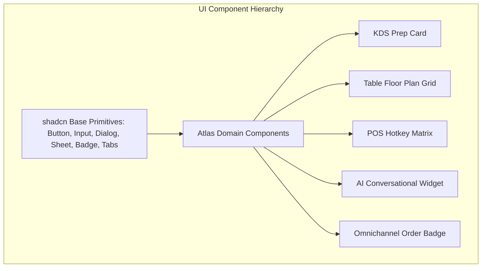
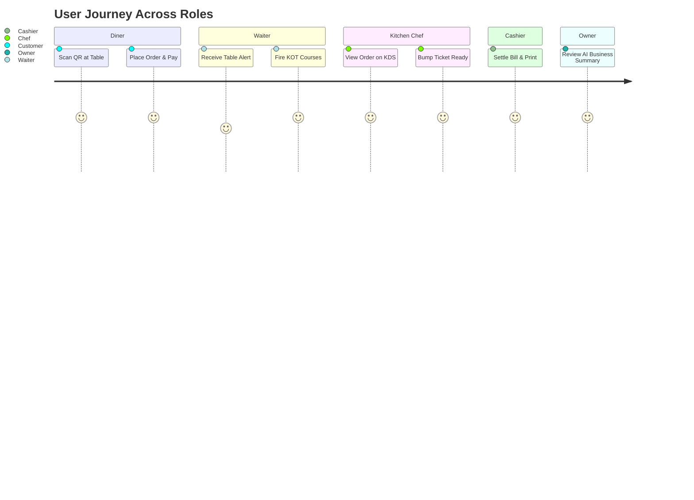

# Atlas UI/UX Design System & Experience Architecture
**Document Version:** 1.0.0  
**Status:** Approved Product Standard  
**Author:** Head of Product Design & Lead UX Architect  
**Design System Core:** Tailwind CSS + shadcn/ui + Lucide Icons  
**Target Screens:** Web POS Terminals, Kitchen Touch Displays, Waiter Handhelds, Mobile QR PWA  

---

## 1. Executive Summary & Design Philosophy

The **Atlas UI/UX Architecture** is engineered for high-stress, fast-paced restaurant environments. In a busy kitchen or cashier counter, every millisecond matters. A unintuitive UI leads to missed orders, slow checkout queues, high staff fatigue, and billing errors.

Atlas adheres to the principle of **Ergonomic Intelligence**: providing role-optimized, zero-clutter interfaces with sub-second feedback micro-interactions, high contrast for kitchen readability, and touch-first hit targets.

```mermaid
graph TD
    subgraph UX Pillars
        P1[1. Ultra-Low Cognitive Load]
        P2[2. Touch-First Ergonomics]
        P3[3. High-Contrast Readability]
        P4[4. Instant Feedback & Haptics]
        P5[5. Contextual AI Guidance]
    end

    subgraph Persona Experiences
        E1[Owner Executive Hub]
        E2[Cashier Express Billing]
        E3[Chef High-Contrast KDS]
        E4[Waiter Mobile Handheld]
        E5[Customer Table QR PWA]
    end

    UX Pillars --> Persona Experiences
```

---

## 2. Design Principles

1. **Speed Over Decoration**: Core transaction paths (POS item selection, KDS order bumping, split billing) MUST require under 3 user taps.
2. **Contextual Role Adaptability**: The interface adapts to the logged-in persona—a cook sees bold timers and oversized cards; an owner sees macro metrics and AI insights.
3. **High-Contrast Dark Mode Default**: Kitchens and POS terminals operate in varied lighting. Dark mode reduces screen glare, eye strain, and power consumption on OLED displays.
4. **Resilient Touch Ergonomics**: Minimum touch target size is `48x48px` with generous spacing to prevent accidental mis-taps during peak rush hours.
5. **Zero-Clutter Hierarchy**: Primary actions (e.g., "Fire KOT", "Print Bill", "Mark Ready") are visually dominant; secondary settings are accessible via standard keybindings (`Cmd+K` / `Ctrl+K`).

---

## 3. Design Tokens & Design System Foundation

Atlas utilizes a cohesive set of design tokens defined via CSS custom properties and mapped directly to **Tailwind CSS** utility classes.

```mermaid
graph LR
    subgraph Design Tokens
        C[Color Palette] --- T[Typography Tokens]
        T --- S[Spacing & Grid]
        S --- E[Elevation & Radius]
    end

    subgraph Component Engine
        shadcn[shadcn/ui Custom Primitives]
    end

    Design Tokens --> shadcn
```

### 3.1. Color Palette Tokens

#### Primary & Brand Colors
- **Atlas Electric Blue** (`--primary`: `hsl(217, 91%, 60%)`): Primary brand accent, call-to-action buttons, key focus rings.
- **Emerald Growth** (`--success`: `hsl(142, 76%, 36%)`): Completed status, positive revenue, paid invoices, stock additions.
- **Amber Warning** (`--warning`: `hsl(38, 92%, 50%)`): Delayed KOT timers, low stock warnings, pending kitchen prep.
- **Crimson Alert** (`--destructive`: `hsl(0, 84%, 60%)`): Overdue KOT orders (> 15m), voided bills, emergency 86'd out-of-stock.

#### Dark Mode Surface Tokens (Default Theme)
- **Background Root** (`--bg-root`: `hsl(224, 71%, 4%)`): Deep slate canvas.
- **Card / Surface Container** (`--bg-surface`: `hsl(222, 47%, 11%)`): Elevated component cards.
- **Border / Divider** (`--border-subtle`: `hsl(217, 33%, 17%)`): Crisp structural division lines.
- **Foreground Primary Text** (`--text-primary`: `hsl(210, 40%, 98%)`): High contrast white text.
- **Foreground Muted Text** (`--text-muted`: `hsl(215, 20%, 65%)`): Secondary subtitles and labels.

---

### 3.2. Typography System
Atlas uses **Outfit** for headlines and numeric displays (high legibility numbers), and **Inter** for UI body copy and data tables.

| Token | Font Family | Size | Weight | Line Height | Application |
| :--- | :--- | :--- | :--- | :--- | :--- |
| `display-lg` | Outfit | 36px (2.25rem) | Bold (700) | 1.1 | Dashboard Metric Counters, Big KDS Timers |
| `heading-1` | Outfit | 28px (1.75rem) | SemiBold (600) | 1.2 | Page Section Titles, KOT Headers |
| `heading-2` | Outfit | 20px (1.25rem) | Medium (500) | 1.3 | Card Headers, Table Identifiers |
| `body-main` | Inter | 16px (1.00rem) | Regular (400) | 1.5 | Primary UI Text, Form Inputs |
| `body-small` | Inter | 14px (0.875rem)| Regular (400) | 1.4 | Secondary Labels, Table Details |
| `caption` | Inter | 12px (0.75rem) | Medium (500) | 1.3 | Badges, Timestamp Tags |

---

### 3.3. Spacing & Touch Grid
- Baseline 4px grid system: `px-1` (4px), `px-2` (8px), `px-4` (16px), `px-6` (24px), `px-8` (32px).
- Minimum Touch Target: `48px` height for all interactive buttons, hotkeys, and table cards.
- Border Radius Tokens: `rounded-sm` (4px), `rounded-md` (8px), `rounded-lg` (12px), `rounded-xl` (16px).

---

## 4. Component Library Architecture (Tailwind + shadcn/ui)



### Key Domain Component Specifications:

1. **KDS Ticket Card Component (`<KDSTicketCard />`)**:
   - High-contrast visual card containing ticket number, station tag, customer prep notes, item checklist, and animated prep stopwatch.
   - Background turns yellow at 10 minutes, flashes red with audio cue at 15 minutes.
   - Bumping ticket requires single tap on large header area.

2. **Table Floor Plan Canvas (`<FloorPlanCanvas />`)**:
   - Interactive canvas displaying dynamic tables with color-coded live states:
     - 🟢 **Green**: Vacant
     - 🔴 **Red**: Occupied (Displays live order total & elapsed dining time)
     - 🟡 **Yellow**: Billed / Awaiting Payment
     - 🔵 **Blue**: Reserved

3. **POS Quick Hotkey Grid (`<POSHotkeyGrid />`)**:
   - Grid of top 20 menu items mapped to numerical keyboard shortcuts (`1-9`).
   - Includes real-time stock indicator badge in top-right corner.

4. **AI Conversational Floating Drawer (`<AIChatDrawer />`)**:
   - Slide-over drawer accessible anywhere via `Cmd+J` or floating sparkle icon.
   - Renders markdown text, interactive data tables, and dynamic chart graphics.

---

## 5. Tailored User Experiences & Personas



### 5.1. Owner Experience: Executive Command Center
- **Core Need**: High-level view of multi-branch revenue, profit margins, operational bottlenecks, and AI business insights.
- **Key Features**:
  - Unified Multi-Branch Revenue Dashboard with real-time live order stream ticker.
  - Embedded AI Assistant box for natural language business queries.
  - Profit & Loss financial breakdown charts with ingredient cost variance metrics.

### 5.2. Manager Experience: Branch Operations Hub
- **Core Need**: Manage daily store operations, floor layout, inventory adjustments, menu availability, and staff shifts.
- **Key Features**:
  - Quick-toggle menu item availability ("86'd" out-of-stock button).
  - Manual inventory adjustment forms with variance detection calculation.
  - Staff shift roster timeline and performance leaderboards.

### 5.3. Cashier Experience: Express Terminal Billing
- **Core Need**: Maximum speed for checkout, split payments, coupon application, and physical receipt printing.
- **Key Features**:
  - Full keyboard shortcut navigation (Zero mouse movement required for experienced cashiers).
  - Quick split bill modal (by seat, by item, or cash/card split).
  - One-tap customer lookup by phone number to apply loyalty points.

### 5.4. Chef / Kitchen Experience: High-Contrast Touch KDS
- **Core Need**: Glanceable order visibility, station item filtering, and single-tap order completion.
- **Key Features**:
  - Oversized typography readable from 6 feet away.
  - Station view filter (Grill Station, Beverage Bar, Main Pantry).
  - Single-tap ticket "Bump" action with instant socket sync to waiter devices.

### 5.5. Waiter Experience: Mobile Handheld Web App
- **Core Need**: Fast table-side order entry, table state visibility, and course firing (Appetizers -> Mains).
- **Key Features**:
  - Mobile-first responsive touch UI designed for one-handed operation.
  - Visual seat-based ordering to facilitate easy split bills later.
  - Instant push notifications when kitchen marks an order item as "READY".

### 5.6. Customer Experience: Zero-Install Table QR PWA
- **Core Need**: Fast menu browsing, visual dish photos, customization, and seamless instant payment.
- **Key Features**:
  - Instant loading under 1 second over 3G cellular connections.
  - Dietary filter toggles (Veg, Non-Veg, Vegan, Gluten-Free).
  - Live visual order status tracker ("Received" -> "Preparing" -> "Served").

### 5.7. Cloud Kitchen Experience: Multi-Brand Dispatch Matrix
- **Core Need**: Consolidate multiple virtual brands on Swiggy and Zomato into a single unified prep dispatch screen.
- **Key Features**:
  - Color-coded brand badges (e.g., Brand A = Purple, Brand B = Orange).
  - Driver arrival time countdown counters.
  - Aggregator menu auto-pause toggles.

---

## 6. Layout Wireframe Architecture

### 6.1. Owner Dashboard Wireframe
```
+-----------------------------------------------------------------------------------+
|  ATLAS OS  [Indiranagar Branch v]    [Search Cmd+K]    (AI Assistant)  (Profile)  |
+--------------+--------------------------------------------------------------------+
|  Dashboard   |  TODAY'S REVENUE       TOTAL ORDERS      AVG PREP TIME   FOOD COST |
|  Orders      |  ₹1,42,850 (+12%)      342 orders        11.4 mins       28.4%     |
|  KDS Live    +--------------------------------------------------------------------+
|  Menu        |  AI BUSINESS BRAIN INSIGHTS                                        |
|  Inventory   |  ✨ Paneer Butter Masala margin dropped 3% due to dairy price spike |
|  Analytics   |  [Ask AI Question...]                                              |
|  Employees   +---------------------------------------+----------------------------+
|  Settings    |  HOURLY ORDER VOLUME (LIVE CHART)     | RECENT HIGH-VALUE ORDERS   |
|              |  [ Chart Graphic ]                    | #ORD-042 - T-04 - ₹2,450   |
|              |                                       | #ORD-041 - Swiggy - ₹890   |
+--------------+---------------------------------------+----------------------------+
```

### 6.2. Kitchen KDS Screen Wireframe
```
+-----------------------------------------------------------------------------------+
|  GRILL STATION KDS  | Active Tickets: 4 | Avg Prep: 9m | [86'd Items (2)]           |
+---------------------+---------------------+---------------------+-----------------+
| #KOT-0089  (04:12)  | #KOT-0090  (11:45)  | #KOT-0091  (16:02)  | #KOT-0092 (01:10)|
| Table T-04          | Swiggy #8921        | Table T-02 (OVERDUE)| Takeaway        |
+---------------------+---------------------+---------------------+-----------------+
| 2x Tandoori Chicken | 1x Bbq Burger       | 3x Mutton Seekh     | 1x Grilled Fish |
|   * Extra Spicy     |   * No Onion        | 1x Garlic Naan      |   * Lemon Butter|
| 1x Paneer Tikka     | 1x Peri Peri Fries  |                     |                 |
+---------------------+---------------------+---------------------+-----------------+
| [ BUMP READY ]      | [ BUMP READY ]      | [ BUMP READY ]      | [ BUMP READY ]  |
+---------------------+---------------------+---------------------+-----------------+
```

---

## 7. Micro-Interactions, Motion & Animations

1. **Framer Motion Micro-Animations**:
   - Order Card Entry: Smooth slide-in from top (`duration: 0.2s`, `ease: "easeOut"`).
   - Ticket Bump Exit: Fade-out with scale reduction (`scale: 0.95`, `opacity: 0`).
2. **Audio & Haptic Feedback**:
   - Incoming Order Sound: Pleasant double-chime for standard orders; distinct urgency bell for aggregators.
   - Haptic Vibration: Web Vibration API (`navigator.vibrate(50)`) triggered on Waiter handheld when kitchen marks order ready.
3. **Optimistic UI Updates**:
   - Toggling an item as "86'd" instantly updates the local UI state before the server confirmation response returns.

---

## 8. Accessibility & Ergonomics

- **WCAG 2.1 AA Compliance**: Contrast ratio of at least `4.5:1` for standard text and `3:1` for large text elements against background surfaces.
- **Keyboard Navigation First**: 100% of POS and Admin features are accessible via keyboard traversal (Tab, Arrow keys, Enter, Esc, and numeric hotkeys).
- **Screen Reader Support**: All UI icon buttons feature explicit `aria-label` tags (e.g., `aria-label="Void Invoice #42"`).