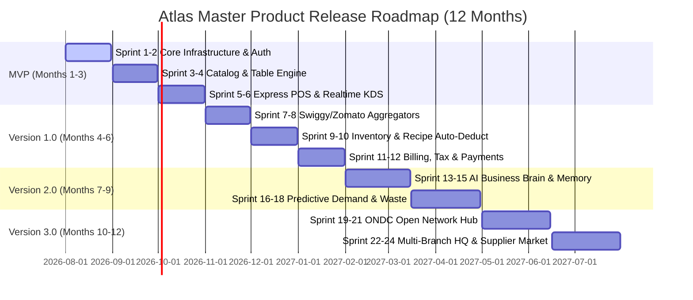
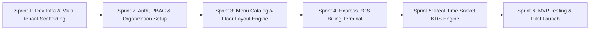
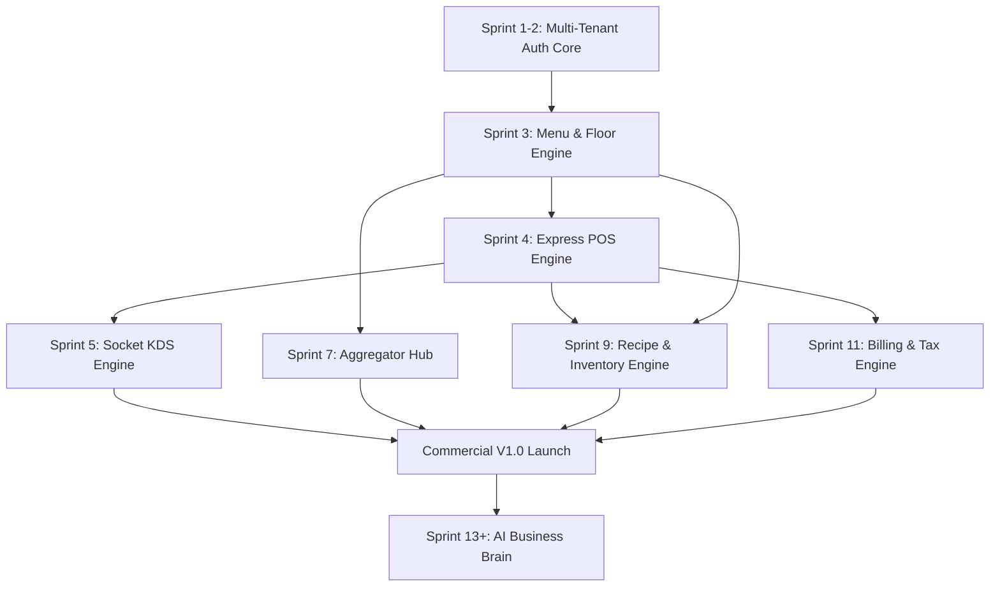
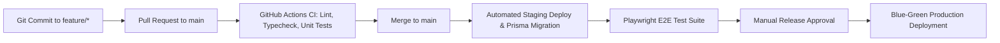

# Atlas Development Roadmap & Delivery Strategy
**Document Version:** 1.0.0  
**Status:** Approved Delivery Plan  
**Author:** Office of the CTO & Lead Program Manager  
**Planning Horizon:** 12 Months (Sprints 1 to 24)  
**Methodology:** Agile Scrum (2-Week Sprints)  

---

## 1. Executive Delivery Strategy

The development of **Atlas** is structured to deliver incremental enterprise value while validating core technical risks early. The architecture prioritizes multi-tenant stability, sub-second real-time performance, recipe ledger precision, and native AI capabilities.

---

## 2. Release Matrix & Version Horizons

| Release Version | Target Timeline | Target Audience | Core Capabilities Included |
| :--- | :--- | :--- | :--- |
| **MVP (v0.5)** | **Month 3** | Beta Pilot Outlets (Single QSR & Cafes) | Core Auth, Multi-tenant DB, Menu Catalog, Dine-In POS, Waiter App, Basic Real-time KDS, Thermal Printing. |
| **Version 1.0** | **Month 6** | Full Commercial Launch (Dine-in & Cloud Kitchens) | Swiggy & Zomato Aggregator Hub, Recipe Ledger Auto-Deduction, Split Billing, GST/VAT Taxes, Staff Roster, Customer QR PWA. |
| **Version 2.0** | **Month 9** | Growth Merchants & Mid-Sized Chains | Native AI Business Brain, Natural Language Queries, Predictive Demand Forecasting, Auto-Stock Reordering, Dynamic Pricing. |
| **Version 3.0** | **Month 12** | Enterprise Chains & Multi-Nationals | ONDC Open Network Protocol, Multi-Branch Franchise HQ, B2B Supplier Marketplace, Custom Fine-Tuned Local LLMs. |

---

## 3. Major Feature Epics

```mermaid
graph TD
    EPIC1[EPIC 1: Multi-Tenant Core & Identity Platform]
    EPIC2[EPIC 2: Dynamic Floor Plan & Menu Catalog Engine]
    EPIC3[EPIC 3: Express POS Billing & Waiter Handheld PWA]
    EPIC4[EPIC 4: Real-Time Sub-Second KDS Engine]
    EPIC5[EPIC 5: Recipe Ledger & Automated Stock Engine]
    EPIC6[EPIC 6: Aggregator Integration Hub Swiggy/Zomato]
    EPIC7[EPIC 7: AI Business Brain & Memory Vector Layer]
    EPIC8[EPIC 8: ONDC Open Network Protocol Engine]
```

### Epic Breakdown:

- **EPIC 1: Multi-Tenant Core & Identity Platform**
  - NestJS API scaffolding, PostgreSQL schema migrations with Prisma, JWT rotation, RS256 token signing, Redis rate limiters, Row-Level Security (RLS) policies.
- **EPIC 2: Dynamic Floor Plan & Menu Catalog Engine**
  - Interactive visual floor canvas (`shadcn/ui`), drag-and-drop table layouts, category hierarchy, modifier groups, branch price override matrix.
- **EPIC 3: Express POS Billing & Waiter Handheld PWA**
  - High-performance web billing terminal, keyboard shortcut hotkeys (`Cmd+K`), seat-based order placement, split bill processor, ESC/POS network printing.
- **EPIC 4: Real-Time Sub-Second KDS Engine**
  - Socket.IO gateway, station-based KOT item routing, visual prep timers, audio alerts, single-tap ticket bumping, out-of-stock ("86'd") toggles.
- **EPIC 5: Recipe Ledger & Automated Stock Engine**
  - Ingredient batch tracking, FIFO auto-deduction on order confirmation, stock variance calculation, reorder point alerts, draft purchase order generation.
- **EPIC 6: Aggregator Integration Hub (Swiggy & Zomato)**
  - Webhook ingestion workers (BullMQ), HMAC signature validation, order auto-acceptance, menu sync engine, auto-pause items on stock depletion.
- **EPIC 7: AI Business Brain & Memory Layer**
  - PGVector embedding store, LLM abstraction layer (OpenAI/Anthropic/Local LLM), natural language query builder (Text-to-SQL), demand forecast models.

---

## 4. Sprint Schedule & Breakdown (Sprints 1 to 12 - MVP to V1.0)

### Phase 1: MVP Core Scaffolding (Sprints 1 - 6)

#### **Sprint 1 (Weeks 1-2): Infrastructure & Scaffolding**
- Setup pnpm workspace monorepo (`apps/api`, `apps/web`, `apps/admin`, `packages/database`).
- Docker Compose dev environment (PostgreSQL 16 + PGVector, Redis, MinIO).
- Prisma schema baseline (Tenants, Organizations, Branches, Users).

#### **Sprint 2 (Weeks 3-4): Auth & Organization Scaffolding**
- Implement JWT access/refresh token rotation with NestJS Passport guards.
- Implement PostgreSQL Row-Level Security (RLS) tenant isolation interceptor.
- User management API endpoints (Create user, assign roles, PIN code hashing).

#### **Sprint 3 (Weeks 5-6): Menu Catalog & Table Layout Engine**
- Build Menu Category, Menu Item, and Modifier Group Prisma models & REST endpoints.
- Develop Next.js Admin menu management UI with image upload to MinIO/S3.
- Develop interactive drag-and-drop floor plan canvas.

#### **Sprint 4 (Weeks 7-8): Express POS Billing Terminal**
- Build POS layout with keyboard hotkeys (`1-9`), category tabs, and search bar.
- Implement order creation state machine (`DRAFT` -> `PLACED` -> `CONFIRMED`).
- Integrate Web ESC/POS driver for network thermal paper printing.

#### **Sprint 5 (Weeks 9-10): Sub-Second Socket KDS Engine**
- Build NestJS Socket.IO gateway with room-based branch broadcasting (`branch:<id>`).
- Develop high-contrast KDS UI screen with item routing and ticket bumping.
- Integrate audio cue alerts and visual overdue timers (> 15 mins).

#### **Sprint 6 (Weeks 11-12): MVP Hardening & Alpha Pilot Launch**
- End-to-end integration testing for Dine-In order flow.
- Deploy staging environment on Docker Swarm / Kubernetes with TLS certificates.
- **MILESTONE 1: MVP Alpha Pilot Live in 3 Test Outlets.**

---

### Phase 2: Commercial Launch V1.0 (Sprints 7 - 12)

#### **Sprint 7-8 (Weeks 13-16): Swiggy & Zomato Aggregator Hub**
- Build external webhook ingestion controllers for Swiggy and Zomato APIs.
- BullMQ queue workers for asynchronous order parsing and auto-acceptance.
- Bidirectional menu status synchronization (Auto 86'd items).

#### **Sprint 9-10 (Weeks 17-20): Recipe Ledger & Automated Stock Engine**
- Build Ingredient, Recipe, RecipeIngredient, and StockLedger database models.
- Implement automatic stock deduction logic triggered upon order confirmation.
- Build Inventory Manager UI for stock reconciliation, variance reports, and POs.

#### **Sprint 11-12 (Weeks 21-24): Billing, Tax Engine & Commercial V1.0 Launch**
- Implement GST/VAT multi-tax splitting rules and split-bill execution engine.
- Integrate Razorpay & Stripe SDK payment checkout modals.
- **MILESTONE 2: Commercial Version 1.0 General Availability (GA).**

---

## 5. Dependency & Critical Path Analysis

### Critical Path Items:
1. **Multi-Tenant RLS Scaffolding (Sprint 1-2)**: Any delay here blocks all downstream module development.
2. **Order State Machine & Socket Gateway (Sprint 4-5)**: Required before Aggregator hub or KDS can function.
3. **Recipe Deduction Engine (Sprint 9)**: Requires stable menu items and order confirmation events.

---

## 6. Risk Management & Mitigation Matrix

| Risk Event | Severity | Probability | Impact | Mitigation Strategy |
| :--- | :---: | :---: | :--- | :--- |
| **Network Outage at POS Counter** | High | High | Cashier unable to process orders or print bills. | Deploy Local Storage / IndexedDB edge fallback allowing local offline order entry and queue sync upon reconnect. |
| **Cross-Tenant Data Leakage** | Critical | Very Low | Severe security breach, loss of merchant trust. | Mandatory dual-layer enforcement: NestJS Guard checking `x-tenant-id` PLUS PostgreSQL Row Level Security (RLS). |
| **KDS Web Socket Reconnection Storm**| Medium | Medium | Server CPU spike during Friday night rush. | Implement exponential jitter backoff on socket client reconnects and Redis Socket adapter clustering. |
| **Aggregator API Webhook Failure** | High | Medium | Orders missed during peak lunch rush. | Implement fallback polling worker every 60 seconds to query Swiggy/Zomato active order endpoint directly. |
| **AI LLM Hallucination in Query Engine**| Medium | Medium | Owner receives inaccurate financial report. | Restrict AI engine to execute verified SQL templates; return raw data tables alongside conversational summaries. |

---

## 7. Release & Deployment Pipeline (CI/CD)

### Deployment Strategy:
- **Blue-Green Zero-Downtime Deployments**: Production cluster swaps router traffic seamlessly without dropping active socket connections.
- **Database Migration Guardrails**: All Prisma migrations must be backward-compatible with the currently running application code.