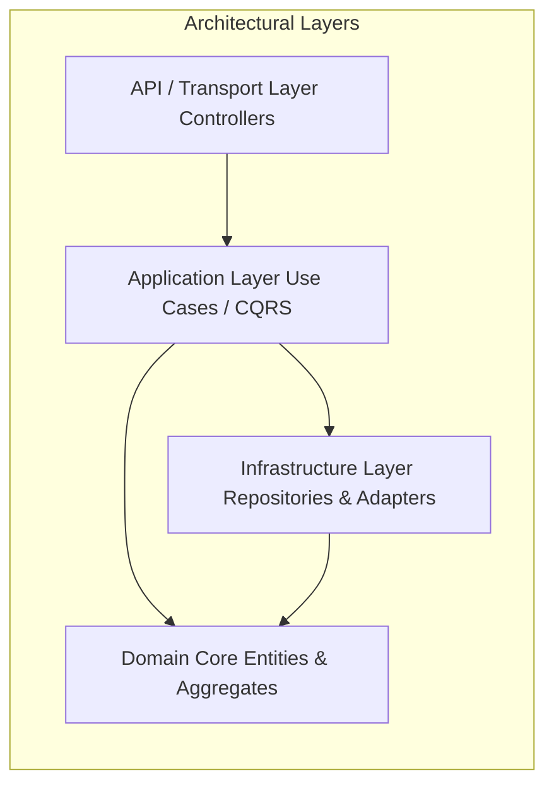
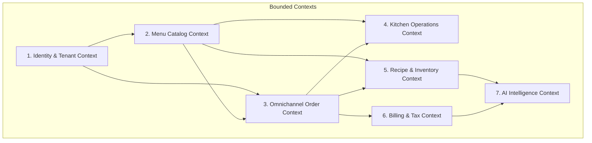
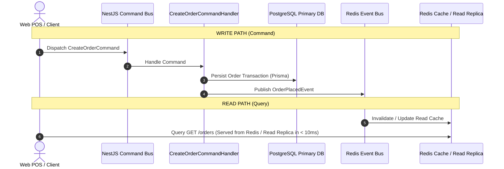
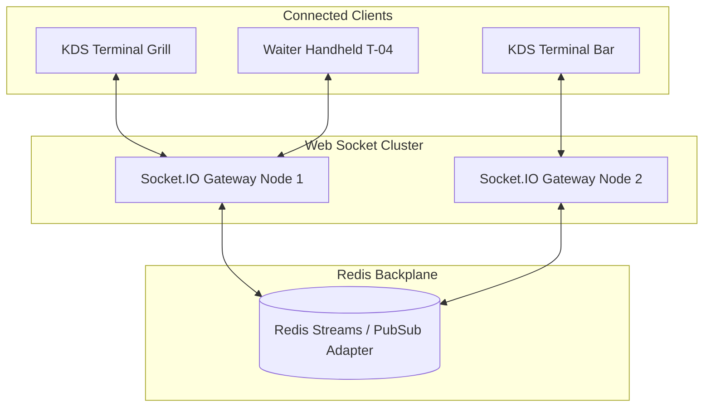
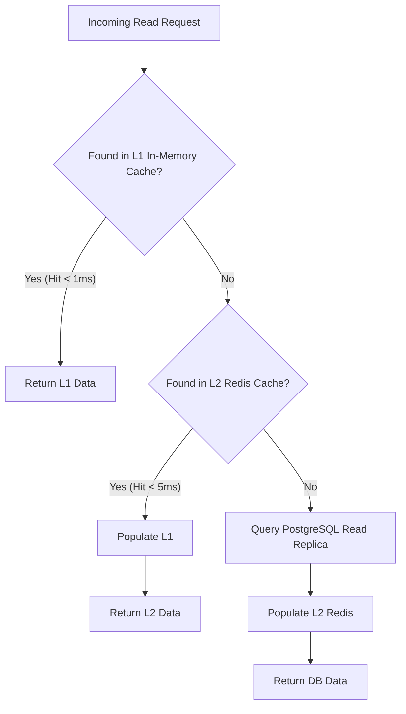
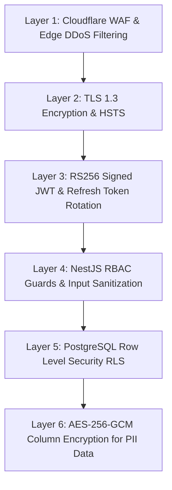

# Atlas Software Architecture & Enterprise Blueprint
**Document Version:** 1.0.0  
**Status:** Approved Master Architectural Standard  
**Author:** Office of the CTO & Chief Systems Architect  
**Architecture Patterns:** Clean Architecture, DDD, CQRS, Event-Driven Architecture (EDA), Modular Monolith (Microservices-Ready)  

---

## 1. Executive System Topology

**Atlas** is an enterprise-grade, multi-tenant AI Restaurant Operating System built to process high-throughput, low-latency transaction streams across dining rooms, kitchens, delivery aggregators (Swiggy, Zomato, ONDC), and autonomous AI engines.

```mermaid
graph TD
    subgraph Client Layer
        WebPOS[Next.js Web POS Terminal]
        KDSUI[React Socket KDS Screen]
        QRPWA[Customer Table QR PWA]
        WaiterApp[Mobile Waiter PWA]
        AdminApp[Admin Multi-Branch Portal]
    end

    subgraph Gateway & Security Layer
        WAF[Cloudflare WAF / DDoS Guard]
        Ingress[Traefik / NGINX Reverse Proxy]
        AuthGuard[NestJS Auth & RLS Tenant Guard]
    end

    subgraph Core Modular Application Services (NestJS)
        AuthDomain[Identity & Tenant Domain]
        OrderDomain[Omnichannel Order Engine]
        KDSDomain[Real-time KDS Gateway]
        StockDomain[Recipe & Stock Ledger]
        BillDomain[Billing & Tax Engine]
        AIDomain[AI Brain Engine]
    end

    subgraph Messaging & Event Infrastructure
        EventBus[Redis Pub/Sub Event Bus]
        TaskQueue[BullMQ Job Queues]
    end

    subgraph Data & Storage Layer
        PostgreSQL[(PostgreSQL Primary DB)]
        PGReplica[(PostgreSQL Read Replicas)]
        Redis[(Redis Cache & Socket Adapter)]
        PGVector[(PGVector Embedding Store)]
        S3Storage[(MinIO / AWS S3 Blob Store)]
    end

    Client Layer --> WAF --> Ingress --> AuthGuard
    AuthGuard --> Core Modular Application Services
    Core Modular Application Services <--> EventBus & TaskQueue
    Core Modular Application Services --> Data & Storage Layer
```

---

## 2. Enterprise Architectural Paradigms



### 2.1. Clean & Layered Architecture
Atlas mandates a strict 4-layer Clean Architecture within every domain module:
1. **Domain Layer (Core)**: Entities, Value Objects, Domain Events, and Repository Interfaces. Free of any framework dependencies (No NestJS or Prisma imports).
2. **Application Layer (Use Cases / CQRS)**: Application services, Command/Query handlers, DTOs, and Event Handlers.
3. **Infrastructure Layer**: Prisma implementations of Repository interfaces, external API HTTP adapters (Swiggy, Zomato, Razorpay), Redis caching implementations, and MinIO storage handlers.
4. **API / Transport Layer**: NestJS REST Controllers, Socket.IO Gateways, and Webhook Ingestion Handlers.

---

### 2.2. Domain-Driven Design (DDD) & Bounded Contexts



- **Ubiquitous Language**: Standardized domain terms (`KOT`, `86'd Item`, `Theoretical Consumption`, `Tenant Scoping`, `Course Firing`) used uniformly across code, tests, and documentation.
- **Aggregates & Entity Roots**:
  - `OrderAggregate` (Root: `Order`, Members: `OrderItem`, `KOTReference`).
  - `RecipeAggregate` (Root: `Recipe`, Members: `RecipeIngredient`, `YieldRatio`).
  - `BranchAggregate` (Root: `Branch`, Members: `Floor`, `Table`).

---

### 2.3. Command Query Responsibility Segregation (CQRS)

To sustain high throughput during peak dining hours, Atlas segregates Write Operations (Commands) from Read Operations (Queries).



- **Commands (Mutations)**: Handled via `CommandBus`. Enforce business invariant validation, transactional integrity, and database writes on Primary PostgreSQL.
- **Queries (Reads)**: Handled via `QueryBus`. Bypasses domain validation; queries optimized read models from Redis cache or Read Replica databases.

---

## 3. Real-Time Socket.IO Architecture & State Sync

Sub-50ms synchronization across KDS screens, Waiter handhelds, and POS counters is powered by a clustered **Socket.IO Gateway** using the **Redis Streams Adapter**.



### Room Topology:
- `tenant:<tenant_id>` — Broadcaster for org-wide system notifications.
- `branch:<branch_id>` — Broadcaster for live order streams and sales counters.
- `kds:<branch_id>:<station>` — Target station routing (e.g., `kds:IND-01:GRILL`).
- `table:<table_id>` — Real-time diner status updates for QR customers.

---

## 4. Multi-Level Caching Hierarchy

To meet sub-10ms read latencies, Atlas implements a 2-tier caching framework:



| Cache Layer | Storage Medium | Target Objects | TTL / Eviction Policy |
| :--- | :--- | :--- | :--- |
| **L1 Local Cache** | Node.js Process Memory (`lru-cache`) | Auth JWT validation public keys, Branch feature flags. | TTL: 60 Seconds, LRU Eviction |
| **L2 Distributed Cache**| Redis 7.2 Cluster | Menu catalog, Active floor table states, User RBAC permissions. | TTL: 1 Hours, Invalidated on Write Events |

---

## 5. Event-Driven Architecture & Message Queue Topology

System components communicate asynchronously using **Redis Pub/Sub** for low-latency events and **BullMQ** for reliable, persistent job processing.

```mermaid
graph TD
    subgraph Event Generators
        OrderSvc[Order Engine]
        StockSvc[Inventory Engine]
        Webhooks[Partner Webhooks]
    end

    subgraph Queue Manager (BullMQ)
        Q1[Queue: order-ingestion]
        Q2[Queue: stock-deduction]
        Q3[Queue: print-dispatch]
        Q4[Queue: ai-embedding-update]
    end

    subgraph Asynchronous Workers
        W1[Order Ingestion Worker]
        W2[Stock Ledger Worker]
        W3[ESC/POS Print Worker]
        W4[PGVector AI Worker]
    end

    OrderSvc --> Q1 & Q2 & Q3 & Q4
    StockSvc --> Q2
    Webhooks --> Q1

    Q1 --> W1
    Q2 --> W2
    Q3 --> W3
    Q4 --> W4
```

### Core Event Payload Schema (`OrderPlacedEvent`):
```json
{
  "eventId": "evt_01HJ89EVENT99",
  "eventType": "ORDER_PLACED",
  "tenantId": "018e3a2b-7c4d-7123-89ab-112233445566",
  "branchId": "018e3a2b-7c4d-7456-89ab-998877665544",
  "timestamp": "2026-07-31T12:00:00.000Z",
  "payload": {
    "orderId": "018e3a2b-7c4d-7999-89ab-333344445555",
    "orderNumber": "ORD-20260731-0042",
    "channel": "DINE_IN",
    "items": [
      { "menuItemId": "018e3a2b-7c4d-7222-89ab-777788889999", "quantity": 2 }
    ]
  }
}
```

---

## 6. AI Architecture & Vector Memory Pipeline

The **Atlas AI Business Brain** couples Large Language Models with **PGVector** retrieval-augmented generation (RAG) to deliver verified operational insights.

```mermaid
graph TD
    subgraph User Prompt Layer
        Prompt[Owner Natural Language Question]
    end

    subgraph AI Engine Orchestrator
        Orchestrator[NestJS AI Agent Orchestrator]
        Embedder[OpenAI text-embedding-3 Engine]
        LLM[LLM Abstraction: OpenAI GPT-4o / Anthropic / Ollama]
    end

    subgraph Knowledge & Vector Store
        VectorDB[(PGVector Menu & Sales Store)]
        SchemaStore[(PostgreSQL Data Dictionary)]
    end

    Prompt --> Orchestrator
    Orchestrator --> Embedder --> VectorDB
    VectorDB -- Relevant Vector Context --> Orchestrator
    Orchestrator --> SchemaStore -- Schema Definitions --> Orchestrator
    Orchestrator --> LLM -- Prompt + Context + Schema --> LLM
    LLM -- Verified SQL Query --> Orchestrator
    Orchestrator -- Execute Safe Query --> PostgreSQL Primary DB
    PostgreSQL Primary DB -- Raw Data --> Orchestrator
    Orchestrator --> LLM -- Synthesize Answer --> User
```

---

## 7. Security Architecture & Multi-Tenant Isolation

Atlas incorporates **Defense-in-Depth Security**:



1. **Row Level Security (RLS)**: Enforced via PostgreSQL database session variables:
   ```sql
   CREATE POLICY tenant_isolation_policy ON orders
   FOR ALL TO application_user
   USING (tenant_id = current_setting('app.current_tenant_id')::uuid);
   ```
2. **API Input Validation**: Enforced via NestJS `ValidationPipe` leveraging `class-validator` to reject malicious injection vectors.

---

## 8. Deployment & CI/CD Pipeline

Atlas uses containerized microservice-ready modular deployments via **Docker** and **GitHub Actions**.

```mermaid
graph LR
    Push[Git Push to Main] --> Lint[Lint & Typecheck]
    Lint --> UnitTest[Run Jest Unit & Domain Tests]
    UnitTest --> DockerBuild[Build Multi-Stage Docker Images]
    DockerBuild --> PushRegistry[Push to GitHub Container Registry GHCR]
    PushRegistry --> DeployStaging[Deploy to Staging Cluster]
    DeployStaging --> PlaywrightE2E[Run Playwright End-to-End Tests]
    PlaywrightE2E --> CanaryDeploy[Canary 10% Production Rollout]
    CanaryDeploy --> FullDeploy[100% Production Swarm Rollout]
```



---

## 9. Observability, Logging & Disaster Recovery

### 9.1. Observability Stack
- **Structured Logging**: `Pino` logger emitting structured JSON logs with correlation IDs (`requestId`, `tenantId`, `traceId`).
- **Metrics & Tracing**: **OpenTelemetry** SDK instrumenting HTTP controllers, Prisma database client queries, and Socket broadcasts, collected via **Prometheus** and visualized in **Grafana**.

### 9.2. Backup & Disaster Recovery SLA
- **Point-in-Time Recovery (PITR)**: PostgreSQL continuous WAL archiving to AWS S3.
- **Recovery Point Objective (RPO)**: `< 1 Minute` (Maximum allowable data loss).
- **Recovery Time Objective (RTO)**: `< 15 Minutes` (Maximum allowable system recovery time).