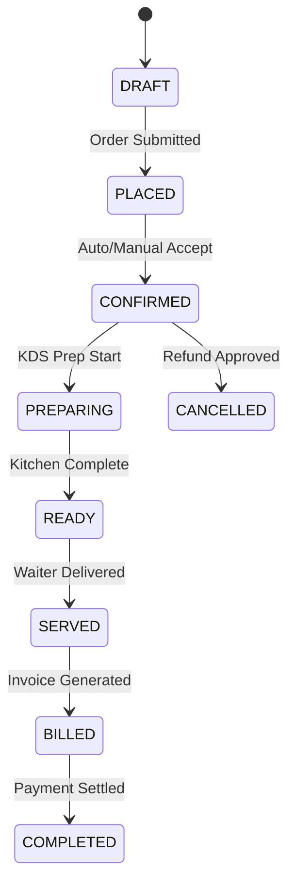
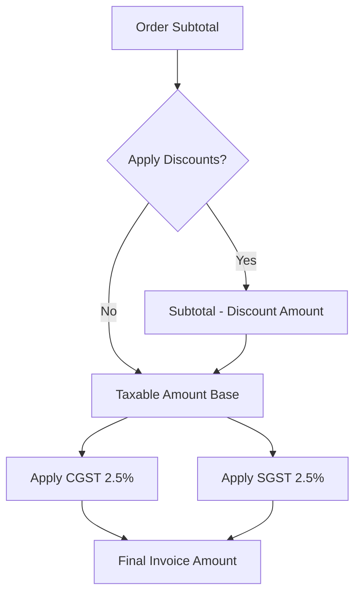
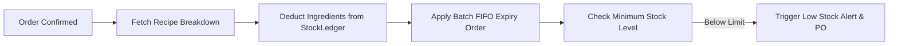
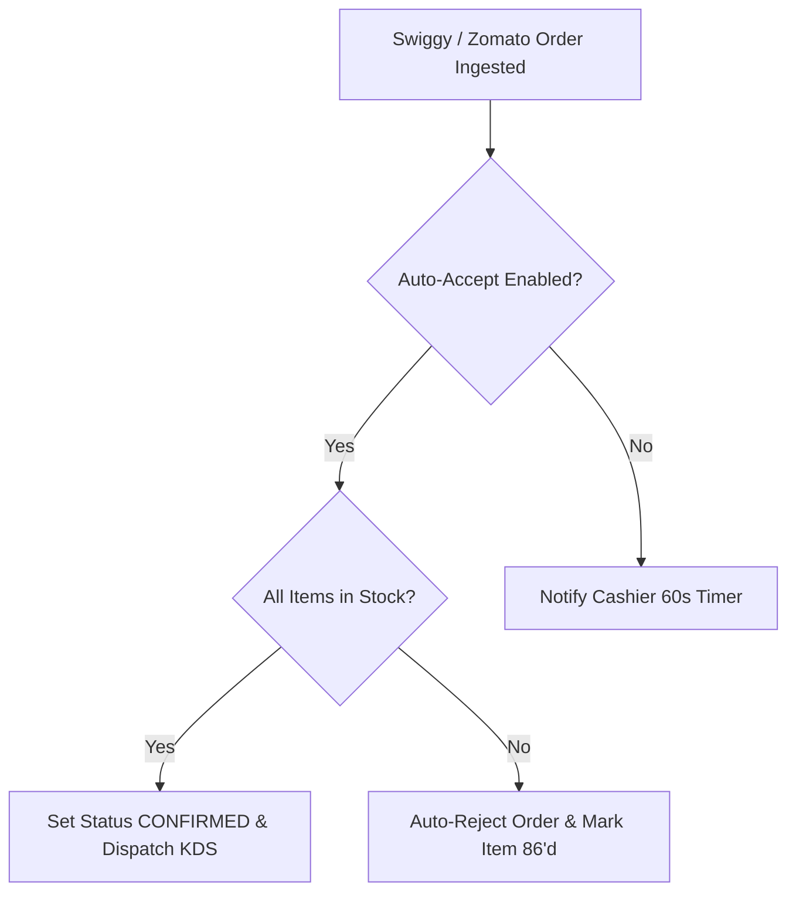
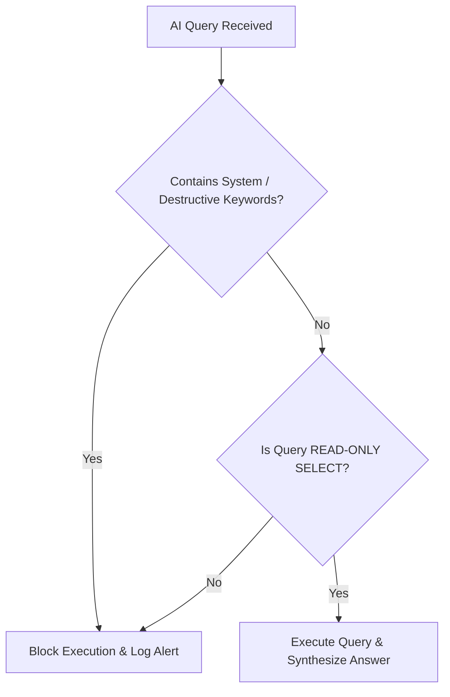

# Atlas Business Rules & Policy Specification
**Document Version:** 1.0.0  
**Status:** Approved Operational Standard  
**Author:** Office of the CTO & Lead Business Logic Architect  
**Scope:** Core Domain Rules, Financial Governance, Operational Invariants  

---

## 1. Executive Summary & Policy Philosophy

This specification defines the unyielding business logic, financial constraints, and operational policies governing **Atlas**. Every rule codified here is mathematically enforced by the NestJS application layer and database transaction boundaries.

Each rule includes an explicit **Rationale ("WHY")** explaining its financial, legal, or operational necessity in preventing fraud, inventory leakage, billing errors, or aggregator non-compliance.

```mermaid
graph TD
    subgraph Governance Core
        R1[Financial & Tax Invariants]
        R2[Inventory & Recipe Integrity]
        R3[Kitchen Operational Workflow]
        R4[Aggregator SLAs & Rules]
        R5[AI Safety Guardrails]
    end

    Governance Core --> NestJS[NestJS Policy Enforcement Engine]
```

---

## 2. Order Lifecycle & State Machine Rules



### BR-ORD-01: Single Terminal Order Immutability Upon Settlement
- **Rule**: Once an order transitions to `COMPLETED` (payment settled and tax invoice issued), its line items, quantities, and prices CANNOT be modified or deleted under any circumstances.
- **Why This Exists**: Prevents cashier theft and tax fraud where a cashier settles a bill with a customer for ₹1,000, then retroactively deletes items in the POS to pocket cash while showing a lower sales total to the business owner and tax authorities.

### BR-ORD-02: Mandatory KOT Generation for Kitchen Prep
- **Rule**: An order item CANNOT enter the kitchen KDS state (`PREPARING`) without a corresponding immutable Kitchen Order Ticket (`kot_ticket`) record generated with a unique sequential sequence number.
- **Why This Exists**: Prevents unrecorded food preparation ("off-the-books cooking") where staff prepare food for friends or cash customers without logging an order in the system, resulting in untracked raw inventory loss.

### BR-ORD-03: Table Occupancy Lock
- **Rule**: A dining table in status `OCCUPIED` CANNOT be assigned to a new incoming table session until the active order associated with that table is either `COMPLETED` or explicitly `CANCELLED` by a Manager.
- **Why This Exists**: Eliminates double-booking errors where waiters accidentally overwrite an active table's order, wiping out the unbilled items of current diners.

---

## 3. Kitchen & KDS Workflow Rules

### BR-KDS-01: Station-Specific Item Routing
- **Rule**: Items within a single order MUST be automatically partitioned across station KDS screens based on item category mappings (e.g., Drinks -> Bar KDS; Steaks -> Grill KDS).
- **Why This Exists**: Prevents kitchen bottlenecks and chaos. Cooks at the grill station are not distracted by drink items, reducing prep distraction and speeding up station throughput.

### BR-KDS-02: Automated Item Out-of-Stock ("86'd") Propagation
- **Rule**: When a chef marks a menu item as "Out of Stock" (86'd) on the KDS screen, the system MUST automatically update item availability to `false` across POS terminals, QR ordering menus, Swiggy, Zomato, and ONDC within 2 seconds.
- **Why This Exists**: Eliminates customer disappointment and aggregator penalty ratings caused by accepting orders for dishes that the kitchen cannot fulfill.

---

## 4. Billing, Tax & Payment Rules



### BR-BIL-01: Sequential Tax Invoice Numbering
- **Rule**: Invoice numbers MUST be generated in strict, unbroken sequential order per branch per financial year (e.g., `INV-IND2627-00001`). Gaps or duplicate invoice numbers are strictly prohibited.
- **Why This Exists**: Mandatory compliance requirement under GST/VAT tax laws. Missing or non-sequential invoice numbers lead to severe tax audit penalties and legal non-compliance.

### BR-BIL-02: Post-Discount Tax Base Calculation
- **Rule**: Sales tax (CGST/SGST/VAT) MUST be computed on the net subtotal AFTER applying order-level and item-level discounts (`Taxable Base = Gross Amount - Discount`).
- **Why This Exists**: Complies with statutory tax regulations. Charging tax on pre-discount amounts illegally overcharges customers, while over-deducting tax base violates government revenue laws.

### BR-BIL-03: Split Bill Monetary Equality Invariant
- **Rule**: When splitting a bill across multiple payers (by seat, by item, or equal split), the mathematical sum of all split sub-invoices MUST EXACTLY match the parent order total:
  $$\sum_{i=1}^{n} \text{Invoice}_i = \text{Order Total}$$
- **Why This Exists**: Prevents financial rounding errors or cashier manipulation during split payment collection, ensuring zero loss of revenue.

---

## 5. Inventory & Recipe Ledger Rules



### BR-INV-01: Recipe Stock Auto-Deduction Upon Order Confirmation
- **Rule**: Raw material ingredient quantities specified in a dish's recipe MUST auto-deduct from the branch's `stock_ledger` immediately when an order transitions to `CONFIRMED`.
- **Why This Exists**: Delivers true real-time inventory visibility. Waiting until end-of-day manual counts masks theft, spoilage, and over-portioning.

### BR-INV-02: First-In, First-Out (FIFO) Batch Consumption
- **Rule**: Ingredient inventory deductions MUST consume stock batches in order of earliest expiration date / receipt date (FIFO).
- **Why This Exists**: Minimizes raw material spoilage and food safety risks by ensuring kitchen staff utilize older perishable inventory before opening new batches.

### BR-INV-03: Theoretical vs. Actual Variance Threshold Alerting
- **Rule**: If the variance between theoretical stock balance (recipe deductions) and physical stock audit count exceeds 3% for a given ingredient in a week, the system MUST generate an automated Security Variance Alert to the Owner.
- **Why This Exists**: Detects ingredient theft (pilferage), kitchen wastage, or improper portion control before it significantly impacts gross profit margins.

---

## 6. Discount & Cancellation Governance Rules

### BR-DSC-01: Mandatory Manager Override for High Discounts
- **Rule**: Any discount exceeding **15% of order subtotal** or **₹500** requires explicit Manager PIN authentication or remote approval via the Manager App.
- **Why This Exists**: Prevents unauthorized cashier collusion where staff grant unauthorized discounts to friends or pocket the cash difference.

### BR-CAN-01: Post-Preparation Order Cancellation Approval
- **Rule**: An order item in status `PREPARING` or `READY` CANNOT be cancelled without a mandatory written cancellation reason code AND Manager PIN authorization.
- **Why This Exists**: Ingredients have already been spent in the kitchen. Uncontrolled cancellations after prep start cause direct raw material financial loss.

---

## 7. Aggregator Integration Rules (Swiggy, Zomato, ONDC)



### BR-AGG-01: Aggregator Price & Item Mapping Synchronization
- **Rule**: Prices and menu availability for food aggregators MUST be pushed automatically from the master Atlas catalog. Manual price overrides on third-party aggregator portals are prohibited.
- **Why This Exists**: Prevents price mismatch errors between POS and delivery platforms, avoiding aggregator reconciliation disputes and customer overcharging complaints.

### BR-AGG-02: 60-Second Auto-Acceptance SLA Guard
- **Rule**: External delivery orders MUST be acknowledged and accepted within 60 seconds of ingestion. If auto-acceptance is disabled and the cashier fails to accept within 45 seconds, an escalating audio alert triggers.
- **Why This Exists**: Aggregators penalize restaurants with lower search algorithm ranking and financial SLA fines if orders are delayed in acceptance.

---

## 8. Employee, Shift & Attendance Rules

### BR-EMP-01: Blind Cash Drawer Reconciliation
- **Rule**: When a cashier closes their daily shift, they MUST enter the physical cash count in their drawer WITHOUT viewing the system's expected cash total ("Blind Reconciliation").
- **Why This Exists**: Prevents cashiers from adjusting their physical cash count or hiding cash discrepancies if they know the system's expected balance beforehand.

### BR-EMP-02: Mandatory PIN Authentication for POS Actions
- **Rule**: Every POS transaction (adding item, firing KOT, printing bill, opening cash drawer) MUST be tagged with the specific logged-in employee's `user_id` authenticated via a 4-digit secret PIN.
- **Why This Exists**: Establishes complete individual accountability for every cash transaction, discount, and order modification.

---

## 9. AI Business Brain Guardrail Rules



### BR-AI-01: Strict Read-Only Database Execution
- **Rule**: The AI Business Brain is strictly restricted to executing `SELECT` queries. Any AI-generated SQL containing `INSERT`, `UPDATE`, `DELETE`, `DROP`, `ALTER`, or `TRUNCATE` is immediately blocked by the query parser.
- **Why This Exists**: Prevents AI hallucination errors or prompt injection attacks from mutating or destroying production restaurant data.

### BR-AI-02: Cross-Tenant AI Memory Isolation
- **Rule**: AI embeddings, prompt contexts, and vector stores MUST include `tenant_id` metadata. Vector similarity searches MUST strictly filter by the authenticated merchant's `tenant_id`.
- **Why This Exists**: Prevents sensitive business intelligence (sales numbers, recipe secrets, customer preferences) from leaking between competing restaurant clients.

---

## 10. Audit & Compliance Governance Rules

### BR-AUD-01: Immutable Audit Trail Logging
- **Rule**: System audit log records (`audit_logs`) are append-only. No system role—including Super Admin—has permission to delete or alter historical audit log rows.
- **Why This Exists**: Guarantees forensic integrity for legal compliance, tax audits, and internal fraud investigations.