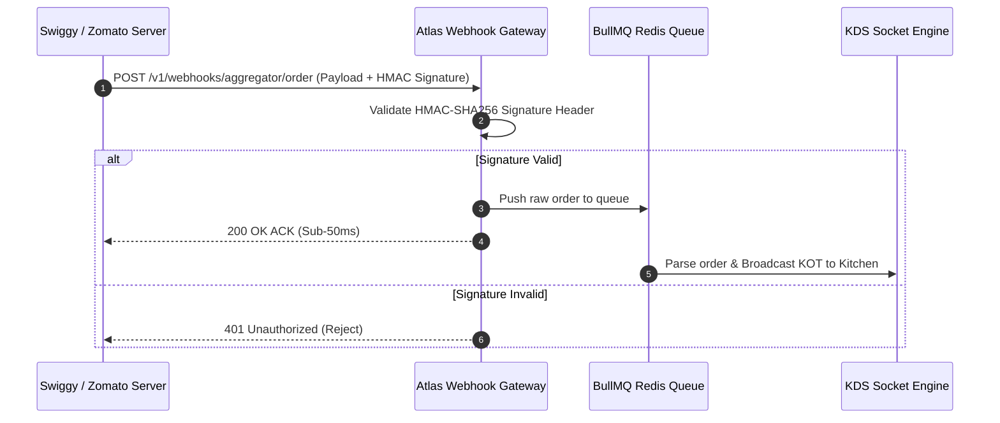
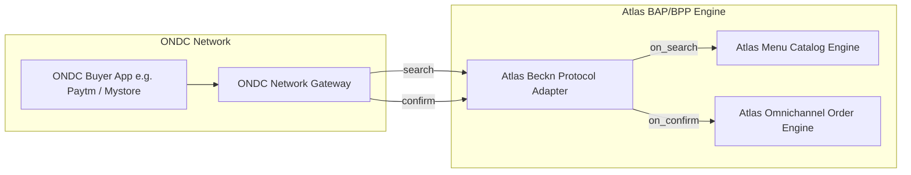
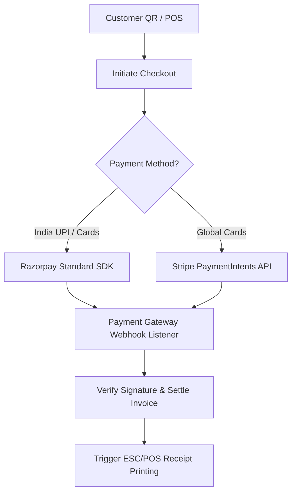
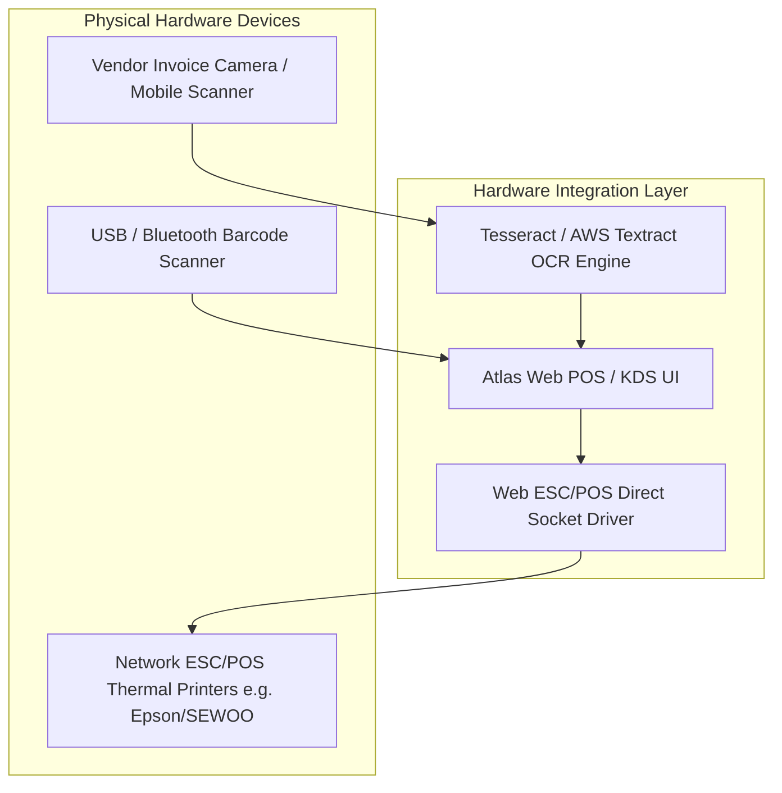
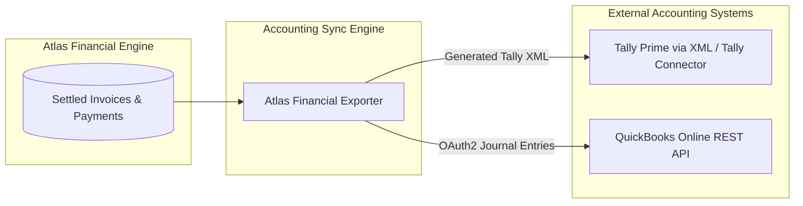
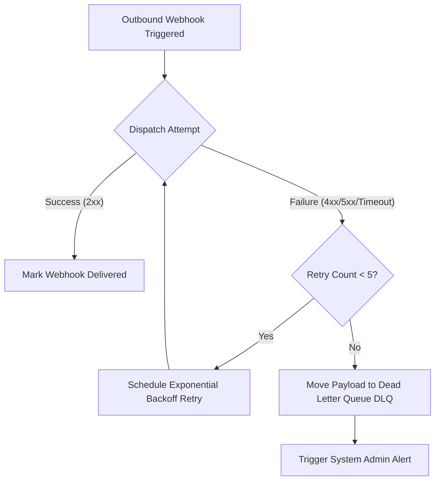

# Atlas Ecosystem Integration & External Interfaces Architecture
**Document Version:** 1.0.0  
**Status:** Approved Technical Standard  
**Author:** Head of Integrations & Enterprise Solutions Architect  
**Scope:** Aggregators, Payment Gateways, Hardware, Messaging, Accounting  

---

## 1. Executive Summary & Integration Topology

**Atlas** acts as the central operational hub of the restaurant. To eliminate manual data re-entry and tool sprawl, Atlas provides robust, low-latency integrations across delivery platforms, payment gateways, messaging services, hardware appliances, and financial accounting tools.

```mermaid
graph TD
    subgraph Atlas Integration Kernel
        Kernel[NestJS Integration Gateway Engine]
    end

    subgraph Food Aggregators & Networks
        S1[Swiggy Partner API]
        S2[Zomato Merchant API]
        S3[ONDC Beckn Protocol]
    end

    subgraph Payment Gateways
        P1[Razorpay UPI & Cards]
        P2[Stripe Terminal & Online]
    end

    subgraph Messaging & Push
        M1[WhatsApp Business API]
        M2[Twilio / Fast2SMS]
        M3[AWS SES Email]
        M4[Firebase FCM Push]
    end

    subgraph Hardware & Edge Devices
        H1[Network ESC/POS Printers]
        H2[USB / Bluetooth Barcode Scanners]
        H3[OCR Document Scanner]
    end

    subgraph Accounting Systems
        A1[Tally Prime XML Engine]
        A2[QuickBooks OAuth REST]
    end

    Kernel <--> S1 & S2 & S3
    Kernel <--> P1 & P2
    Kernel --> M1 & M2 & M3 & M4
    Kernel --> H1 & H2 & H3
    Kernel --> A1 & A2
```

---

## 2. Food Aggregator & Open Network Integrations

### 2.1. Swiggy & Zomato Partner Integrations

#### Capability Matrix:
1. **Order Ingestion**: Real-time webhook ingestion with sub-50ms HTTP acknowledgement.
2. **Auto-Acceptance SLA**: Automated acceptance response dispatched within 5 seconds of order placement.
3. **Menu & Stock Sync**: Pushes out-of-stock ("86'd") status for items directly to Swiggy/Zomato portals via REST APIs.

---

### 2.2. ONDC (Open Network for Digital Commerce) Protocol Integration

Atlas implements the open **Beckn Protocol** to enable direct customer ordering on the ONDC network without third-party commission fees.

#### Implemented Beckn Actions:
- `search` / `on_search`: Publishes branch menu catalog, pricing, and fulfillment coverage.
- `select` / `on_select`: Validates item availability, customized modifiers, and delivery fees.
- `init` / `on_init`: Collects customer delivery address and initializes payment terms.
- `confirm` / `on_confirm`: Ingests verified ONDC order directly into Atlas POS and KDS.
- `track` / `on_track`: Provides live order prep status and rider GPS coordinates to buyer apps.

---

## 3. Payment Gateway Integrations

### 3.1. Razorpay Integration
- **Capabilities**: Dynamic UPI QR code generation on POS customer displays, UPI Intent deep-linking for mobile QR ordering, Razorpay POS Card Terminals.
- **Webhook Events Monitored**: `payment.captured`, `payment.failed`, `refund.processed`.
- **Security**: HMAC-SHA256 signature verification over `X-Razorpay-Signature`.

### 3.2. Stripe Integration
- **Capabilities**: Global credit/debit card processing, Apple Pay, Google Pay, 3D-Secure 2.0 authentication.
- **Webhook Events Monitored**: `payment_intent.succeeded`, `payment_intent.payment_failed`.

---

## 4. Customer Communication & Messaging Gateways

### 4.1. WhatsApp Business API
- **Provider**: Meta WhatsApp Cloud API / Twilio for WhatsApp.
- **Use Cases**:
  1. **Digital Receipt Dispatch**: Sends interactive PDF tax invoice to customer's WhatsApp upon bill payment.
  2. **Direct QR Ordering**: Sends order status updates ("Order Confirmed", "Food Ready").
  3. **Re-engagement Campaigns**: Sends targeted promotional offers to high-value diners.

### 4.2. SMS & Email Gateways
- **SMS Gateways**: Fast2SMS / Twilio for 6-digit staff login OTPs and emergency low-stock SMS alerts to managers.
- **Email Gateway**: AWS SES / Resend for daily automated executive P&L PDF reports sent to restaurant owners at midnight.

### 4.3. Firebase Cloud Messaging (FCM)
- **Use Case**: Real-time push notifications delivered to Waiter Handheld PWA apps and Manager Android/iOS devices when urgent events occur (e.g., KOT overdue > 15m, table requesting waiter).

---

## 5. Hardware & Edge Appliance Integrations

### 5.1. Network Thermal Printers (ESC/POS Protocol)
- **Protocol**: Direct TCP/IP Socket connection over Local Area Network (Port 9100) or WebUSB.
- **Capabilities**: Formatted paper KOT printing, tax invoice printing, auto-cutter triggers, and cash drawer kick out pulses (`ESC p 0 25 250`).

### 5.2. Barcode & QR Code Scanners
- **Supported Hardware**: Standard USB/Bluetooth HID Barcode Scanners.
- **Use Cases**: Fast scanning of packaged food items at QSR counters and raw material inventory batch barcodes during receiving.

### 5.3. Optical Character Recognition (OCR) Vendor Invoice Reader
- **Engine**: AWS Textract / Tesseract.js OCR Pipeline.
- **Workflow**: Manager snaps a photo of a physical raw material paper receipt from a supplier; OCR extracts line items, quantities, and prices, pre-populating an Atlas Purchase Order record.

---

## 6. Enterprise Accounting Software Integrations

### 6.1. Tally Prime Integration
- **Format**: Standard Tally XML Vouchers (`VOUCHERTYPE="Sales"`).
- **Sync Frequency**: Daily automated scheduled cron job at 23:59 or manual export download.
- **Data Mapped**: Sales revenue by category, GST tax breakdown (CGST, SGST, IGST), payment mode ledger postings (Cash ledger, Card ledger, Bank ledger).

### 6.2. QuickBooks Online Integration
- **Authentication**: OAuth 2.0 PKCE flow.
- **API Endpoint Used**: `POST /v3/company/{realmId}/journalentry`.

---

## 7. Webhook Security, Retry Strategy & Resilience

To guarantee zero data loss during network hiccups or third-party downtime, Atlas implements a strict webhook resilience pattern.

### Retry Schedule Matrix:

| Attempt | Backoff Delay | Strategy |
| :--- | :--- | :--- |
| **Attempt 1** | Immediate | Initial Dispatch |
| **Attempt 2** | 60 Seconds (1 min) | Exponential Backoff |
| **Attempt 3** | 300 Seconds (5 mins) | Exponential Backoff |
| **Attempt 4** | 1,800 Seconds (30 mins)| Exponential Backoff |
| **Attempt 5** | 7,200 Seconds (2 hours)| Final Retry before DLQ routing |