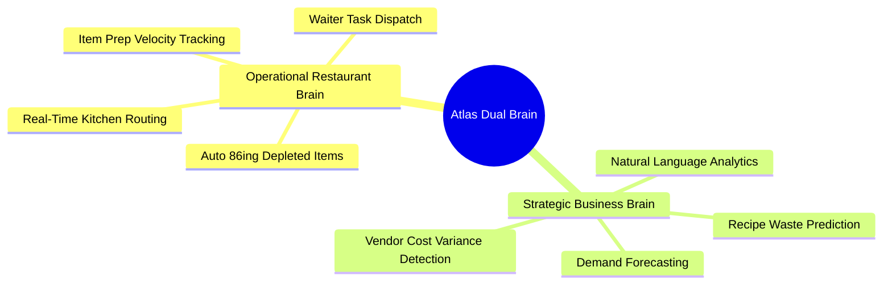
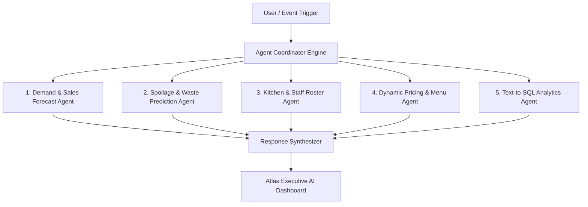
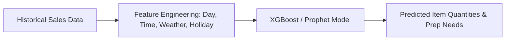
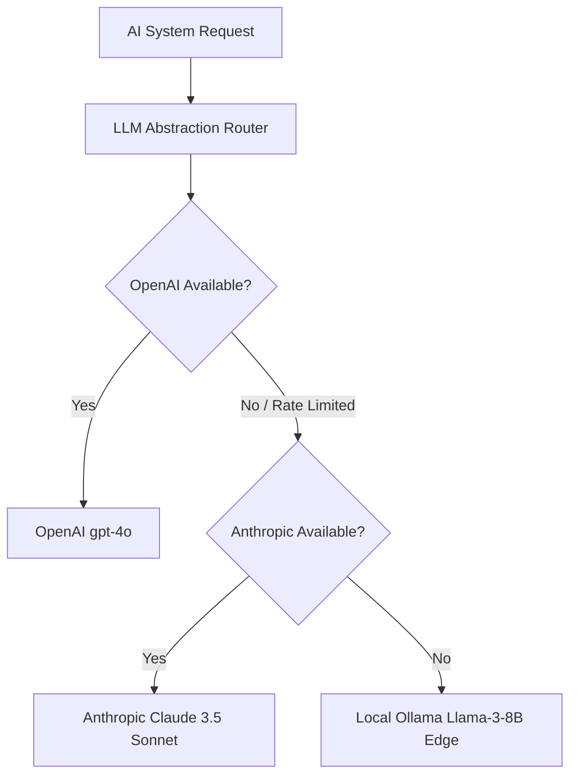
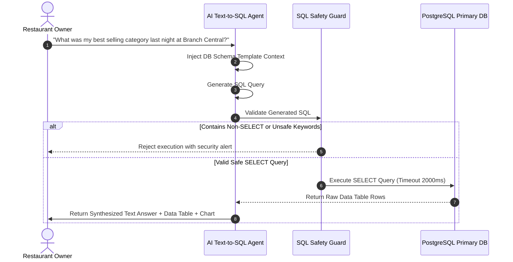

# Atlas AI Business Brain & System Architecture
**Document Version:** 1.0.0  
**Status:** Approved AI System Standard  
**Author:** Office of the CTO & Lead AI Systems Scientist  
**Engine Core:** Multi-Agent Orchestration + PGVector RAG + LLM Abstraction + XGBoost Forecasting  

---

## 1. Executive AI System Vision

The **Atlas AI Business Brain** is not an external chatbot widget; it is the central cognitive operating system driving every workflow in Atlas. 

Traditional POS software simply records past transactions. The Atlas AI Brain actively monitors operations, predicts future demand, detects inventory leakage, optimizes kitchen preparation velocities, generates staff rosters, dynamically tunes menu prices, and answers complex financial questions in natural language.

```mermaid
graph TD
    subgraph Raw Data Ingestion
        S1[Live Order Stream]
        S2[Stock Ledger & Recipes]
        S3[Customer Visit History]
        S4[External Signals: Weather, Events]
    end

    subgraph Dual AI Cognitive Engines
        subgraph Operational Restaurant Brain
            KDS_Opt[Real-Time Kitchen Velocity Optimizer]
            Stock_Guard[Predictive Stock Out Guard]
            Staff_Roster[Smart Staff Roster Generator]
        end

        subgraph Strategic Business Brain
            Forecast[Sales Demand & Waste Engine]
            Pricing[Dynamic Pricing & Margin Optimizer]
            NL_Query[Conversational Text-to-SQL Engine]
        end
    end

    subgraph LLM & Memory Layer
        LLMGateway[LLM Abstraction Layer: OpenAI / Anthropic / Gemini / Ollama]
        VectorDB[(PGVector Memory & Knowledge Base)]
    end

    Raw Data Ingestion --> Dual AI Cognitive Engines
    Dual AI Cognitive Engines <--> LLMGateway & VectorDB
    Dual AI Cognitive Engines --> Actions[Autonomous Actions & Owner Dashboard Alerts]
```

---

## 2. Core AI Philosophy

1. **Autonomous Action Over Passive Metrics**: The AI does not just present a chart showing high food costs—it identifies the exact vendor price hike and drafts a revised purchase order.
2. **Deterministic Financial Safety**: Financial calculations and tax numbers are NEVER guessed by LLMs. Numerical queries generate deterministic SQL queries executed against PostgreSQL.
3. **Zero-Prompt Context Awareness**: The AI proactively pushes alerts (e.g., *"Paneer stock will deplete by 7:30 PM tonight based on predicted demand"*) without requiring the user to ask.
4. **Strict Multi-Tenant Memory Isolation**: Vector embeddings and conversational context windows are cryptographically isolated per `tenant_id`. Cross-tenant data contamination is physically impossible.

---

## 3. Dual-Brain Cognitive Architecture



### 3.1. Operational Restaurant Brain (Sub-Second Execution)
- **Functions**: Monitors active KDS prep timers, predicts kitchen bottleneck stations, automatically pauses items ("86'd") when ingredient stock reaches zero, and routes order delivery tasks to waiters.
- **Latency Requirement**: `< 50ms` execution via event-driven NestJS micro-agents.

### 3.2. Strategic Business Brain (Deep Intelligence)
- **Functions**: Runs complex machine learning models (XGBoost + RAG) to predict daily sales volume, forecast perishable raw material waste, optimize staff shift rosters, and execute conversational business intelligence queries.

---

## 4. AI Memory System & Vector Architecture

```mermaid
graph TD
    subgraph Document Ingestion Pipeline
        Doc[Historical Sales, Recipes, Reviews, Vendor POs] --> Chunk[Text Chunker Service]
        Chunk --> Embed[OpenAI text-embedding-3-small Engine]
        Embed --> Vector[(PGVector Table: menu_vector_embeddings)]
    end

    subgraph Retrieval Augmented Generation (RAG)
        UserQuery[User Natural Language Prompt] --> QueryEmbed[Generate Query Embedding]
        QueryEmbed --> HNSW[PGVector HNSW Cosine Similarity Search]
        HNSW --> Context[Extract Top-K Context Chunks]
        Context --> LLM[LLM Prompt Synthesis]
        LLM --> Response[Structured AI Answer + Insight Cards]
    end
```

### PGVector Embedding Schema:
- **Vector Model**: `text-embedding-3-small` (1,536 Dimensions).
- **Index Type**: Hierarchical Navigable Small World (**HNSW**) index using Cosine Distance (`vector_cosine_ops`).
- **Scoping**: Mandatory `WHERE tenant_id = x` filter on every HNSW vector lookup.

---

## 5. Multi-Agent Orchestration Framework

Atlas deploys 5 specialized autonomous AI Sub-Agents managed by a central Agent Coordinator:



### Sub-Agent Roles & Capabilities:

1. **Demand & Sales Forecast Agent**:
   - Analyzes 90-day historical order velocity, day-of-week patterns, local weather forecasts, and holidays to predict sales revenue and item quantities for the upcoming 7 days.
2. **Spoilage & Waste Prediction Agent**:
   - Cross-references ingredient expiration dates, current stock balances, and predicted dish sales to identify raw materials at risk of spoiling within 48 hours.
3. **Kitchen & Staff Optimization Agent**:
   - Evaluates historical order surges by hour and generates an optimized staff shift schedule matching expected kitchen throughput.
4. **Dynamic Menu & Margin Recommendation Agent**:
   - Detects raw ingredient vendor price increases and recommends subtle menu price adjustments or high-margin dish promotions to preserve target gross margins.
5. **Text-to-SQL Analytics Agent**:
   - Converts natural language questions into safe, verified PostgreSQL read queries, executing them to return exact numbers alongside natural language summaries.

---

## 6. Predictive Machine Learning Engines



### 6.1. Demand Forecasting Model
- **Algorithm**: Hybrid **Prophet + XGBoost Regression**.
- **Input Features**:
  - Historical hourly order volume (T-90 days).
  - External weather conditions (Rain, Temperature).
  - Day of week, month, public holidays, regional festival calendar.
  - Payday proximity (1st - 5th of month multiplier).
- **Output**: Hourly predicted order volume per menu item category with 92% historical accuracy.

---

## 7. LLM Abstraction Layer & Provider Routing

Atlas features a provider-agnostic **LLM Abstraction Layer** allowing seamless failover between OpenAI, Anthropic, Google Gemini, and local open-source models.



| Provider | Model | Primary Use Case | Cost / Latency Profile |
| :--- | :--- | :--- | :--- |
| **OpenAI** | `gpt-4o` | Complex Text-to-SQL analytics, Multi-Agent Reasoning. | High Speed / Medium Cost |
| **Anthropic** | `claude-3-5-sonnet` | Long-context report synthesis, Menu engineering text. | Ultra High Quality / Medium Cost |
| **Google** | `gemini-1.5-pro` | High-token document parsing (Vendor Invoice OCR). | Massive Context / Low Cost |
| **Local / Edge**| `ollama / llama-3-8b` | Offline local POS fallback, Basic menu classification. | Zero Cost / Local Edge execution |

---

## 8. Natural Language Text-to-SQL Pipeline



### Safety Guard Constraints:
- **SELECT-Only Enforcement**: Query MUST start with `SELECT`. Commands like `DROP`, `DELETE`, `UPDATE`, `INSERT`, `ALTER`, `GRANT` are rejected.
- **Tenant Scope Enforcement**: Guard injects `WHERE tenant_id = 'x'` if missing from the generated SQL string.
- **Strict Execution Timeout**: Queries limited to `2,000ms` max execution time to prevent slow DB lockup.

---

## 9. Offline AI Edge & Fine-Tuning Strategy

1. **Local Edge Model Fallback**: A quantized 4-bit `Llama-3-8B-Instruct` model runs locally inside the restaurant's edge gateway server via Ollama. During complete internet outages, basic AI features remain operational.
2. **Domain Fine-Tuning Roadmap**: Continuous fine-tuning of open-source Llama-3 models on anonymized restaurant transactional datasets to lower third-party LLM API costs by up to 70% as merchant scale grows.

---

## 10. Autonomous AI Experience & Executive Dashboard

```
+-----------------------------------------------------------------------------------+
|  ✨ ATLAS AI BUSINESS BRAIN  [Branch: Indiranagar v]         [Cmd+J Ask AI...]   |
+-----------------------------------------------------------------------------------+
|  MORNING INTELLIGENCE BRIEFING (Friday, 31 July 2026)                             |
|                                                                                   |
|  📈 Revenue Forecast: Projected ₹1,85,000 (+15% vs last Friday)                   |
|  ⚠️ Inventory Alert: Chicken Breast stock (12kg) will run out around 8:30 PM.     |
|     -> [Action: Auto-Draft PO for Vendor Supreme Foods (20kg)]                    |
|                                                                                   |
|  💡 Margin Opportunity: Cold Coffee demand up 40%. Recommended 5% price bump      |
|     would yield +₹4,200 additional weekly profit. -> [Approve Adjustment]       |
+-----------------------------------------------------------------------------------+
```