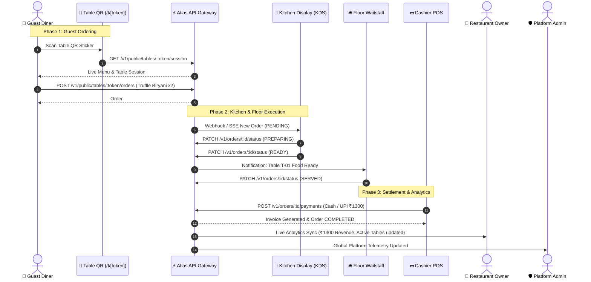
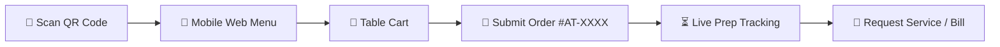
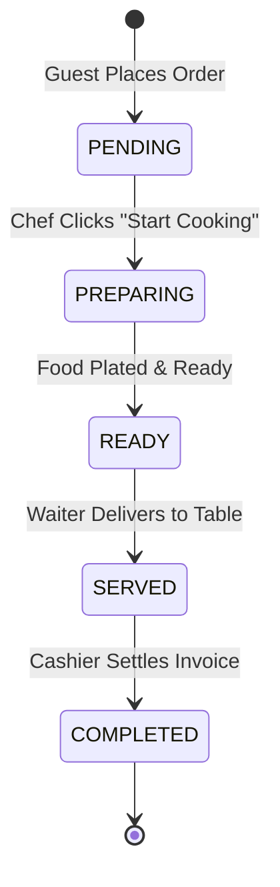

# 🌍 Project Atlas v1.0 — End-to-End System & Admin Guide

> **Official Comprehensive Operational Architecture, Multi-Tenant Data Flow, and Platform Administration Manual**  
> *Version:* `1.0.0-PROD` | *Architecture:* Modular NestJS Monolith + Next.js 16 App Router | *Data Layer:* PostgreSQL + Prisma ORM + Redis

---

## 📑 Table of Contents

1. [System Architecture & Multi-Tenant Hierarchy](#1-system-architecture--multi-tenant-hierarchy)
2. [End-to-End Visual Data Flow](#2-end-to-end-visual-data-flow)
3. [Platform Admin Panel Workflow (`/platform-admin`)](#3-platform-admin-panel-workflow-platform-admin)
4. [Restaurant Owner & Management Workflow](#4-restaurant-owner--management-workflow)
5. [Guest QR Ordering Lifecycle (Zero App Download)](#5-guest-qr-ordering-lifecycle-zero-app-download)
6. [Kitchen (KDS), Waiter & Cashier Workflow](#6-kitchen-kds-waiter--cashier-workflow)
7. [AI Restaurant Copilot & Automation Engine](#7-ai-restaurant-copilot--automation-engine)
8. [Role-Based Access Control (RBAC) Matrix](#8-role-based-access-control-rbac-matrix)
9. [Disaster Recovery, Security & Operations Runbook](#9-disaster-recovery-security--operations-runbook)

---

## 1. System Architecture & Multi-Tenant Hierarchy

Project Atlas enforces strict hierarchical multi-tenancy with row-level scoping. Every request is authenticated via JWT and validated through tenant boundary guards.

```
PLATFORM ADMIN (Global Infrastructure, Global Monitoring, Support Desk, Subscription Tiers)
  └── TENANT (Billing Organization, Subscription Account, Master Owner)
        └── RESTAURANT (Concept Branding, Master Menu, AI Copilot, Automation Rules)
              └── BRANCH (Physical Location, Local Inventory, Operating Hours)
                    └── DINING AREA (Floor Plan Section: Indoor, Rooftop, Courtyard)
                          └── TABLE (Unique QR Session Token `tbl_xxxx`, Real-time Cart)
                                └── ORDERS & PAYMENTS (KDS Pipeline: PENDING ➔ PREPARING ➔ READY ➔ SERVED ➔ COMPLETED)
```

### Core Security Guards

| Guard | Layer | Enforcement Rule | Violation Action |
|---|---|---|---|
| `JwtAuthGuard` | Global | Validates cryptographically signed access JWT | `HTTP 401 Unauthorized` |
| `TenantAccessGuard` | Organization | Ensures `user.tenantId == resource.tenantId` | `HTTP 403 Forbidden` |
| `RestaurantAccessGuard` | Restaurant | Scopes `x-restaurant-id` header to active tenant | `HTTP 403 Forbidden` |
| `BranchAccessGuard` | Location | Verifies branch belongs to active restaurant | `HTTP 403 Forbidden` |
| `PlatformAdminGuard` | Infrastructure | Requires `user.role === 'PLATFORM_ADMIN'` | `HTTP 403 Forbidden` |

---

## 2. End-to-End Visual Data Flow



---

## 3. Platform Admin Panel Workflow (`/platform-admin`)

The Platform Admin interface is the central command desk for Atlas operators.

```
┌─────────────────────────────────────────────────────────────────────────────┐
│                       ATLAS PLATFORM CONTROL DESK                           │
├───────────────────┬───────────────────┬───────────────────┬─────────────────┤
│  🏢 Total Tenants │  🍽️ Active Rests   │  📈 Platform MRR  │  ⚡ API Latency │
│        43         │        43         │     ₹4,25,000     │      P95: 42ms  │
└───────────────────┴───────────────────┴───────────────────┴─────────────────┘
```

### Key Workspaces in `/platform-admin`

1. **Global Overview Tab**:
   - Cross-tenant metrics: Aggregate gross merchandise value (GMV), system-wide order velocity, total active sessions.
   - P50, P95, and P99 API latency tracking and server memory health.
2. **Tenant & Subscription Management**:
   - Audit customer accounts, manage plan tiers (`FREE`, `GROWTH`, `ENTERPRISE`), adjust branch/table quotas, and toggle feature flags.
3. **Incident & Customer Support Desk**:
   - Real-time queue of tickets submitted by restaurant owners.
   - Filter by category (`TECHNICAL`, `BILLING`, `HARDWARE`, `MENU_SETUP`).
   - SLA Prioritization (`URGENT`, `HIGH`, `NORMAL`, `LOW`).
   - Platform engineers enter resolution notes and mark tickets `RESOLVED` / `CLOSED`.
4. **Database & Infrastructure Probes**:
   - Live PostgreSQL connection pool monitoring.
   - Redis background queue throughput and job retry counts.

---

## 4. Restaurant Owner & Management Workflow

### A. 6-Step Guided Onboarding (`/onboarding`)

1. **Restaurant Profile**: Configure restaurant concept, cuisine classification, business phone, and operational currency (INR ₹).
2. **Floor & Dining Areas**: Provision dining sections (e.g. *Main Courtyard*, *Rooftop Terrace*) and initialize table counts.
3. **QR Ordering Generation**: Provision encrypted public session tokens (`tbl_xxxx`) and generate printable QR vectors.
4. **Menu Catalog**: Create master menu categories, add signature dishes, configure portion pricing, and set dietary tags.
5. **Staff & Roles**: Send invites for Kitchen chefs, Floor waiters, Cashiers, and Managers with auto-assigned permission boundaries.
6. **Payments & Launch**: Activate payment channels (Cash, Dynamic UPI QR, POS Terminal) and transition to live status.

### B. Live Operations Dashboard (`/dashboard`)

- **Sales Velocity**: Today's revenue, completed tickets, average order value (AOV).
- **Floor Occupancy**: Real-time table status (Vacant, Seated, Ordering, Billed).
- **Hourly Sales Heatmap**: Identification of peak lunch (12–3 PM) and dinner (7–10 PM) rushes.
- **Top Performers**: Revenue and quantity ranking of best-selling menu items.

---

## 5. Guest QR Ordering Lifecycle (Zero App Download)



1. **Scan & Instant Session (`/t/[token]`)**:
   - Customer scans physical QR code on table stand.
   - Mobile browser loads without app installation or login friction.
2. **Menu Exploration**:
   - Browse categories, filter by dietary flags (`Veg`, `Non-Veg`, `Vegan`, `Gluten-Free`), and select dish modifiers.
3. **Table Cart & Kitchen Notes**:
   - Multi-guest shared cart updates in real time.
   - Special preparation instructions (e.g. *"Mild spice, no dairy"*) attached to line items.
4. **Order Confirmation**:
   - Generates high-visibility order ticket (`#AT-000001`) and pushes ticket directly to the kitchen display.
5. **Table Service Requests**:
   - Diners can tap *"Call Waiter"*, *"Water Refill"*, or *"Request Bill"* directly from their phone.

---

## 6. Kitchen (KDS), Waiter & Cashier Workflow



### Operational Screen Reference

| Role | Workspace | Actions |
|---|---|---|
| **🍳 Chef / KDS** | `/kitchen` | View incoming tickets with item timers; advance tickets from `PENDING` $\to$ `PREPARING` $\to$ `READY`. |
| **🛎️ Floor Waiter** | `/waiter` | View tables with `READY` dishes; deliver hot food and mark `SERVED`; handle table assistance calls. |
| **💵 Cashier / POS** | `/cashier` | Review aggregated table bills; apply discounts/taxes (CGST/SGST); accept Cash/UPI/Card and mark `COMPLETED`. |

---

## 7. AI Restaurant Copilot & Automation Engine

### AI Restaurant Copilot (`/ai-copilot`)
The AI Copilot connects directly to the real-time PostgreSQL database with contextual memory.

**Example Queries:**
- *"What was our total revenue and best-selling item yesterday?"*
- *"Which tables currently have open orders over 45 minutes?"*
- *"Compare lunch revenue vs dinner revenue over the past 30 days."*

### Scheduled Automation Engine (`AutomationModule`)
- 📊 **Nightly Sales Report (`0 23 * * *`)**: Summarizes daily gross sales, order count, and payment method breakdown at 11:00 PM.
- ⚠️ **Low Stock Warning**: Automatically checks inventory thresholds after every completed order and alerts the manager.
- 💡 **AI Operational Recommendations (`0 9 * * 1`)**: Analyzes weekly dish margins and recommends pricing or menu layout adjustments.

---

## 8. Role-Based Access Control (RBAC) Matrix

| Permission Scope | `PLATFORM_ADMIN` | `OWNER` | `MANAGER` | `KITCHEN` | `WAITER` | `CASHIER` | `GUEST` |
|---|:---:|:---:|:---:|:---:|:---:|:---:|:---:|
| **Platform Telemetry** | ✅ Full | ❌ | ❌ | ❌ | ❌ | ❌ | ❌ |
| **Manage Subscription** | ✅ Full | ✅ Own | ❌ | ❌ | ❌ | ❌ | ❌ |
| **Support Desk (Resolve)**| ✅ Full | ❌ | ❌ | ❌ | ❌ | ❌ | ❌ |
| **Support Desk (Submit)** | ✅ | ✅ | ✅ | ❌ | ❌ | ❌ | ❌ |
| **Menu Engineering** | 👁️ Audit | ✅ Full | ✅ Edit | 👁️ Read | 👁️ Read | 👁️ Read | 👁️ Read |
| **Kitchen KDS** | 👁️ Audit | ✅ | ✅ | ✅ Full | 👁️ Read | 👁️ Read | ❌ |
| **Take Orders / Waiter** | 👁️ Audit | ✅ | ✅ | ❌ | ✅ Full | ✅ | ❌ |
| **Settle Payments / POS**| 👁️ Audit | ✅ | ✅ | ❌ | ❌ | ✅ Full | ❌ |
| **Public Table QR Cart** | ❌ | ❌ | ❌ | ❌ | ❌ | ❌ | ✅ Full |

---

## 9. Disaster Recovery, Security & Operations Runbook

### Key CLI Operations

```bash
# 1. Run Complete Monorepo Production Build
pnpm build

# 2. Execute Master Unit & Integration Tests (38 Suites, 201 Tests)
pnpm test

# 3. Verify Multi-Tenant Security & Isolation Boundaries
pnpm test:security

# 4. Run Load Testing & Saturation Benchmark
pnpm test:load

# 5. Run Pilot Restaurant Onboarding & Lifecycle Acceptance
pnpm test:pilot

# 6. Trigger Disaster Recovery Relational Database Backup
pnpm db:backup

# 7. Re-export Official End-to-End System Guide PDF
pnpm pdf:export
```

### Disaster Recovery Guarantee
The `pnpm db:backup` command snapshots all 13 core relational tables into an encrypted timestamped JSON archive in `./backups/` and runs foreign key consistency verification across all records.

---

*Project Atlas v1.0 • Enterprise Restaurant Operating System*  
*Document Generated: August 2026 • Confidential & Proprietary*
